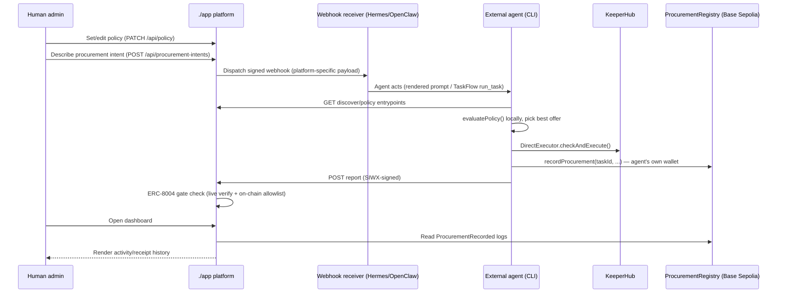

# Enterprise Procurement Agent Platform

**Use case #4 — Enterprise procurement agent**, built on the **Lucid Agents
SDK** (`@lucid-agents/*`), **KeeperHub** (`@keeperhub/sdk`), and a Foundry
contracts project (`./contracts`) on **Base Sepolia**.

> "Find an agent capable of moving 1M USDC from our treasury to an approved
> lending protocol, but only if APY > 4%."

A human enterprise admin says that once, through this platform's dashboard.
`./app` is **management infrastructure, not the actor**: it records the
intent, pushes it out as a webhook to whichever external agent (Hermes
Agent, OpenClaw) is subscribed, and gates any results that come back with a
live, on-chain ERC-8004 identity check. The **external agent itself** —
running the `agent-skills` CLI toolkit on its own machine, with its own
KeeperHub key and its own wallet — is the one that discovers candidate
lending-protocol agents over A2A/Agent Cards, evaluates the enterprise's
policy, executes via KeeperHub's guarded on-chain call, and writes the
receipt to `ProcurementRegistry` on Base Sepolia.

**The core split:** the agent's own `agent-skills` CLI decides *who to buy
from and how to execute* (A2A discovery, policy evaluation, KeeperHub).
`./app` decides *whether that agent is allowed to act at all* (ERC-8004
identity gate) and *shows the enterprise what happened* (on-chain activity
history). Neither one does the other's job.

## Target architecture

```mermaid
flowchart TB
    subgraph Human["Human enterprise admin"]
        Admin["Sets policy,\ndescribes procurement intent"]
    end

    subgraph App["./app — management platform"]
        UI["Dashboard UI"]
        PolicyStore["Policy store\n(editable)"]
        WebhookReg["Webhook subscriber\nregistry + dispatcher"]
        Gate["ERC-8004 live gate\n(lib/identity/gate.ts)"]
        ReportAPI["Report-ingestion entrypoint\n(SIWX + gate-checked)"]
        ChainReader["Chain reader"]
        Mocks["Mock provider agents\n(Aave/Compound/Morpho/Yearn)"]
    end

    subgraph Chain["Base Sepolia"]
        Registry["ProcurementRegistry.sol\n(./contracts)\nauthorizedAgents allowlist +\nProcurementRecorded events"]
        IdRegistry["ERC-8004 Identity +\nReputation Registries"]
    end

    subgraph External["External agent (Hermes / OpenClaw)"]
        WebhookRecv["Webhook receiver"]
        CLI["agent-skills CLI\nprocure act / submit"]
        KH["KeeperHub\nDirectExecutor"]
    end

    Admin --> UI
    UI -->|edit| PolicyStore
    UI -->|submit intent| WebhookReg
    WebhookReg -->|signed POST| WebhookRecv
    WebhookRecv --> CLI
    CLI -->|discover / policy| Mocks
    CLI -->|policy| PolicyStore
    CLI --> KH
    KH -->|checkAndExecute| DeFi[("DeFi protocol\ncontracts")]
    CLI -->|recordProcurement\n(agent's own wallet)| Registry
    CLI -->|POST report\n(SIWX-signed)| ReportAPI
    ReportAPI --> Gate
    Gate -->|verify| IdRegistry
    Gate -->|pass -> addAuthorizedAgent| Registry
    ChainReader -->|read logs| Registry
    ChainReader --> UI
```

`External` above is deliberately generic — it's whichever agent runtime the
enterprise admin registered a webhook route for. `./agent-demo` is this
repo's own concrete implementation of that box: it reads `./agent-skills`
itself, reasons over an LLM via OpenRouter, and drives the `CLI` node above
(`procure`) — see [`agent-demo/README.md`](agent-demo/README.md).

## Repository layout

| Path | What it is | Docs |
| --- | --- | --- |
| `./app` | Next.js 16 App Router — the management platform's dashboard + API | [`app/README.md`](app/README.md) |
| `./app/api/agent` | The agent-facing surface: A2A Agent Card, SIWX-protected `authenticate`/`discover`/`policy`/`report`/`procurement_status` entrypoints | [`app/README.md`](app/README.md) |
| `./app/lib/identity/gate.ts` | Live ERC-8004 verification of an inbound caller (composes `@lucid-agents/identity`'s registry-client primitives) | [`app/README.md`](app/README.md) |
| `./app/lib/webhooks` | Subscriber registry + per-platform (Hermes/OpenClaw/generic) webhook dispatch | [`app/README.md`](app/README.md) |
| `./app/lib/chain` | viem client reading/writing `ProcurementRegistry` on Base Sepolia | [`app/README.md`](app/README.md) |
| `./contracts` | Foundry project: `ProcurementRegistry.sol` — on-chain activity history + on-chain agent allowlist | [`contracts/README.md`](contracts/README.md) |
| `./agent-skills` | An [Agent Skills](https://agentskills.io/home)-compliant skill teaching an external agent how to act on a dispatched webhook | [`agent-skills/README.md`](agent-skills/README.md) |
| `./agent-skills/scripts/cli` | `procure` CLI — now the actor: discovery/policy read, KeeperHub execution, on-chain receipt write, all with the external agent's own credentials | [`agent-skills/README.md`](agent-skills/README.md), [`agent-skills/scripts/cli/README.md`](agent-skills/scripts/cli/README.md) |
| `./agent-demo` | A demo **external agent** playing the same actor/role as a real Hermes Agent or OpenClaw install: reads `./agent-skills` itself at runtime, reasons over an LLM (via [OpenRouter](https://openrouter.ai/docs/quickstart)), and drives the `procure` CLI to act | [`agent-demo/README.md`](agent-demo/README.md) |

`./app`, `./agent-skills/scripts/cli`, `./agent-demo`, and `./contracts` are
four independent, self-contained projects (each with its own dependency
management — `npm`/`npm`/`npm`/`forge`) living side by side in this repo.

## What's real vs. simulated

| Piece | Status |
| --- | --- |
| SIWX challenge/sign/verify (EIP-191 signature, nonce, expiry) | **Real.** `@lucid-agents/payments`. |
| A2A discovery + invocation (Agent Cards, `quote` skill calls) | **Real.** `@lucid-agents/a2a`, against three small real agent runtimes `./app` hosts. |
| ERC-8004 inbound gate | **Real, live on-chain verification.** `app/lib/identity/gate.ts` calls `@lucid-agents/identity`'s `IdentityRegistryClient`/`ReputationRegistryClient` against Base Sepolia — not a static allowlist. |
| On-chain activity history | **Real.** `ProcurementRegistry.sol` (`./contracts`), deployed to Base Sepolia; the dashboard reads `ProcurementRecorded` events directly via viem. |
| AP2 commerce-role mandate | **Real.** `@lucid-agents/ap2` — `shopper` (the external agent) / `merchant` (each provider). |
| KeeperHub execution | **Real SDK, `@keeperhub/sdk`**, now run by the external agent's own CLI with its own org key — falls back to a same-shaped simulated result when unset. |
| The three "lending protocol" providers (Aave/Compound/Morpho gateway agents) | **Simulated economics**, real `@lucid-agents/core` A2A agents `./app` hosts at `/api/mock-providers/*` — the market, not the actor, so it stays platform-hosted regardless of who's buying. |
| Hermes/OpenClaw webhook delivery | **Real wire format** (fetched from each platform's own docs), but registering a route on either platform happens on that agent operator's own instance — this repo can only dispatch to a URL/secret they provide. |

## Quickstart

```bash
cd app
npm install
cp .env.example .env.local     # every value has a safe local-dev default
npm run dev                    # http://localhost:3000
```

Open the dashboard: set policy, add a webhook subscriber (or leave none to
just inspect dispatch behavior), and describe a procurement intent. Or drive
the actor side directly, as an external agent would once dispatched:

```bash
curl http://localhost:3000/api/agent/.well-known/agent-card.json
cd agent-skills/scripts/cli && npm install
node bin/procure.ts submit --instruction "Move 1M USDC to an approved lending protocol, but only if APY > 4%." --amount 1000000
```

`submit` runs the full local pipeline (discover -> evaluate policy ->
KeeperHub execute -> record on-chain -> report to the dashboard) using
whatever `PROCURE_*` credentials are configured, falling back to
KeeperHub-demo-mode and skipping the on-chain write if they're not set.

That's the deterministic reference path. To see an actual **agent** decide
to run it — verifying a webhook, choosing `submit` vs. `act`, reading
`agent-skills/references/*.md` on demand — use `./agent-demo` instead:

```bash
cd agent-demo
npm install
cp .env.example .env   # set OPENROUTER_API_KEY, see https://openrouter.ai/docs/quickstart
node bin/agent-demo.ts webhook --platform generic --payload fixtures/webhook-generic.json
```

See [`agent-demo/README.md`](agent-demo/README.md).

## Interaction model



| Step | Entrypoint / route | Auth / gate | Purpose |
| --- | --- | --- | --- |
| 1. Set policy | `PATCH /api/policy` | admin-only (dashboard) | Human-editable treasury policy (max amount, allowed assets/protocols, min APY). |
| 2. Describe intent | `POST /api/procurement-intents` | admin-only (dashboard) | Records a pending intent and dispatches it as a webhook — **no execution happens here.** |
| 3. Webhook delivery | Hermes `/webhooks/<route>` or OpenClaw `/plugins/webhooks/<routeId>` or a generic URL | HMAC / Bearer, per platform | The platform-specific, admin-registered subscriber receives the intent. |
| 4. Discover + policy (read) | `GET /api/agent/entrypoints/discover/invoke`, `.../policy/invoke` | none | The external agent reads platform-hosted market data and the current policy. |
| 5. Execute | *(off-platform)* | the agent's own KeeperHub key | `evaluatePolicy()` locally, then `DirectExecutor.checkAndExecute()` — this app never sees these credentials. |
| 6. Record on-chain | `ProcurementRegistry.recordProcurement()` | on-chain `authorizedAgents` allowlist | The agent's own wallet writes the durable receipt. |
| 7. Report | `POST /api/agent/entrypoints/report/invoke` | SIWX + live ERC-8004 gate | Rich detail (timeline, policy evaluation) for the dashboard, tied to the same `taskId` as the on-chain receipt. |
| 8. Poll | `POST /api/agent/entrypoints/procurement_status/invoke` | none | Look up a previously reported task by id. |

### Server secrets vs. caller secrets

The two credential sets below never mix. `./app` cannot read, set, or
override anything the external agent holds, and vice versa:

| Platform-side (`app/.env`) | Actor-side (`agent-skills` CLI / external agent's own env) |
| --- | --- |
| `CONTRACT_OWNER_PRIVATE_KEY` — administers the on-chain `authorizedAgents` allowlist only after a live ERC-8004 check passes. Never touches enterprise funds. | `PROCURE_PRIVATE_KEY` — the external agent's own wallet: signs SIWX challenges *and* writes the on-chain receipt. |
| `AGENT_MCP_API_KEY` — shared secret `app/api/agent/mcp` checks incoming requests against. | `PROCURE_MCP_API_KEY` — the same value, held by the caller. |
| `RPC_URL` / `PROCUREMENT_REGISTRY_ADDRESS` — used only for read-only chain queries and the gate's registry lookups. | `PROCURE_KEEPERHUB_API_KEY` / `PROCURE_KEEPERHUB_BASE_URL` / `PROCURE_KEEPERHUB_EXECUTION_MODE` — the agent's own KeeperHub org credentials. Never held by `./app`. |
| *(nothing — the platform no longer holds a treasury or KeeperHub key at all)* | `PROCURE_REGISTRY_ADDRESS` / `PROCURE_RPC_URL` — same contract, used to broadcast the write. |

See [`app/README.md#environment-variables`](app/README.md#environment-variables)
and [`agent-skills/README.md#environment-variables`](agent-skills/README.md#environment-variables)
for the full tables.

## Environment variables (consolidated)

| Variable | Used by | Default |
| --- | --- | --- |
| `APP_PUBLIC_ORIGIN`, `SIWX_PUBLIC_ORIGIN` | app / `@lucid-agents/payments` | `http://localhost:3000` |
| `PAYMENTS_RECEIVABLE_ADDRESS`, `PAYMENTS_NETWORK`, `PAYMENTS_FACILITATOR_URL` | `@lucid-agents/payments` | zero address / `eip155:84532` / `https://x402.org/facilitator` |
| `AGENT_DOMAIN`, `RPC_URL`, `CHAIN_ID`, `IDENTITY_AGENT_ID` | `@lucid-agents/identity` + `lib/identity/gate.ts` + `lib/chain/registry.ts` | unset -> static self-declared identity; `RPC_URL` defaults to Base Sepolia public RPC |
| `IDENTITY_REGISTRY_ADDRESS`, `REPUTATION_REGISTRY_ADDRESS` | `lib/identity/gate.ts` | unset -> resolved via `@lucid-agents/identity`'s `getRegistryAddress()` |
| `AGENT_MCP_API_KEY` | `./app/api/agent/mcp` | unset -> open (local dev) |
| `PROCUREMENT_REGISTRY_ADDRESS` | `lib/chain/registry.ts` | unset -> on-chain history/gating disabled |
| `CONTRACT_OWNER_PRIVATE_KEY` | `lib/chain/registry.ts` (admin writes only) | unset -> authorizing agents fails |
| `POLICY_MAX_USD_PER_TASK`, `POLICY_MIN_APY_BPS`, `POLICY_ALLOWED_ASSETS`, `POLICY_ALLOWED_PROTOCOLS` | seed defaults for the now-editable policy store | `1000000` / `400` / `USDC` / `aave-v3,compound-v3,morpho` |
| `DEPLOYER_PRIVATE_KEY`, `BASE_SEPOLIA_RPC_URL`, `BASESCAN_API_KEY` | `./contracts` deploy script | — |
| `PROCURE_BASE_URL`, `PROCURE_PRIVATE_KEY`, `PROCURE_MCP_API_KEY`, `PROCURE_KEEPERHUB_API_KEY`, `PROCURE_KEEPERHUB_BASE_URL`, `PROCURE_KEEPERHUB_EXECUTION_MODE`, `PROCURE_REGISTRY_ADDRESS`, `PROCURE_RPC_URL` | `procure` CLI (the actor) | `http://localhost:3000` / ephemeral signer / none / demo mode / ... |
| `OPENROUTER_API_KEY`, `OPENROUTER_MODEL`, `OPENROUTER_BASE_URL` | `agent-demo`'s LLM client (the actor's decision layer) | none (required) / `openai/gpt-4o-mini` / `https://openrouter.ai/api/v1` |
| `AGENT_DEMO_PERSONA`, `AGENT_DEMO_NAME` | `agent-demo` — which real agent runtime (`hermes`/`openclaw`/`generic`) this run role-plays as | `generic` / `Demo External Agent` |

## Further reading

- [`app/README.md`](app/README.md) — platform architecture, sequence diagram, module table, full env var table.
- [`contracts/README.md`](contracts/README.md) — `ProcurementRegistry.sol`, build/test/deploy.
- [`agent-skills/README.md`](agent-skills/README.md) — the Agent Skills package and CLI, for teaching an external agent how to act on a dispatched webhook.
- [`agent-skills/scripts/cli/README.md`](agent-skills/scripts/cli/README.md) — every `procure` CLI command paired with the raw `curl` command it's equivalent to (where one exists).
- [`agent-demo/README.md`](agent-demo/README.md) — the LLM-driven demo external agent (via OpenRouter) that reads `./agent-skills` itself and drives `procure`, standing in for a real Hermes Agent/OpenClaw install.
