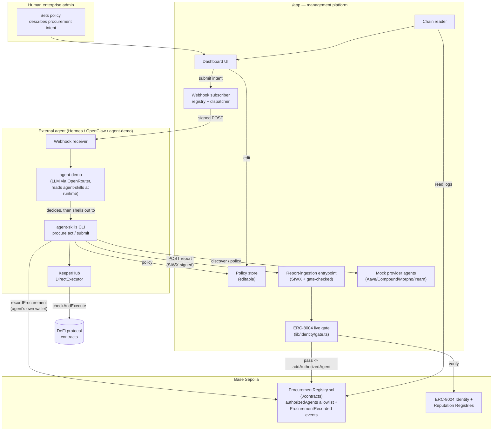
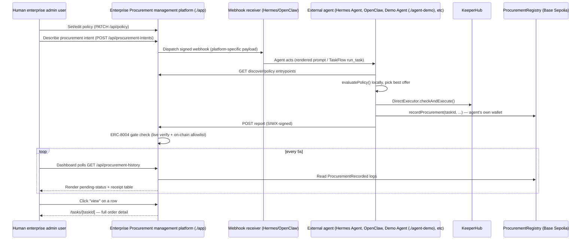

# Enterprise Procurement Agent — Management Platform

## Overview

This is the "Enterprise Procurement Agent -- Mangement Platform", where enable AI Agent to shape the traditional enterprise procurement workflow.

As a use case, an human enterprise admin user prompt like this:

> "Find an agent capable of moving 1M USDC from our treasury to an approved
> lending protocol, but only if APY > 4%."

Then, **enterprise procurement agent**, built on the **[Lucid Agents
SDK](https://docs.daydreams.systems/)** (`@lucid-agents/*`, powered by
**[Daydreams](https://www.daydreams.systems/)**), **[KeeperHub](https://docs.keeperhub.com/)** (`@keeperhub/sdk`), would coordinate with the smart contracts (`./contracts`) on **Base Sepolia** to execute an enterprise procurement workflow by the prompt-inputted like above by the human enterprise admin user.


A human enterprise admin says that once, through this platform's dashboard.
`./app` is **management infrastructure, not the actor**: it records the
intent, pushes it out as a webhook to whichever external agent (Hermes
Agent, OpenClaw) is subscribed, and gates any results that come back with a
live, on-chain ERC-8004 identity check. The **external agent itself** —
running the `agent-skills` CLI toolkit on its own machine, with its own
KeeperHub key and its own wallet — is the one that discovers candidate
lending-protocol agents over A2A/Agent Cards, evaluates the enterprise's
policy, executes via KeeperHub's guarded on-chain call, and writes the
receipt to `ProcurementRegistry` contract on Base Sepolia.

**The core split:** the agent's own `agent-skills` CLI decides *who to buy
from and how to execute* (A2A discovery, policy evaluation, KeeperHub).
`./app` decides *whether that agent is allowed to act at all* (ERC-8004
identity gate) and *shows the enterprise what happened* (on-chain activity
history). Neither one does the other's job.

NOTE: Currently, a Demo Agent (`./agent-demo`) can work with this platform by reading the `./agent-skills`. This agent skills (`./agent-skills`) has been on the way to expand for **Hermes Agent** and **OpenClaw** near the future.


## Architecture



`External` above is deliberately generic — it's whichever agent runtime the
enterprise admin registered a webhook route for. `./agent-demo` is this
repo's own concrete implementation of that box: it reads `./agent-skills`
itself, reasons over an LLM via OpenRouter, and drives the `CLI` node above
(`procure`) — see [`agent-demo/README.md`](agent-demo/README.md).


## Interaction Flow



| Step | Entrypoint / route | Auth / gate | Purpose |
| --- | --- | --- | --- |
| 1. Set policy | `PATCH /api/policy` | admin-only (dashboard) | Human-editable treasury policy (max amount, allowed assets/protocols, min APY). |
| 2. Describe intent | `POST /api/procurement-intents` | admin-only (dashboard) | Records a pending intent (with a fresh bytes32 `taskId`, `app/lib/chain/taskId.ts`) and dispatches it as a webhook — **no execution happens here.** The dashboard's "Dispatch to subscribed agents" button disables itself and shows a spinner for the duration of this call. |
| 3. Webhook delivery | Hermes `/webhooks/<route>` or OpenClaw `/plugins/webhooks/<routeId>` or a generic URL | HMAC / Bearer, per platform | The platform-specific, admin-registered subscriber receives the intent. |
| 4. Discover + policy (read) | `GET /api/agent/entrypoints/discover/invoke`, `.../policy/invoke` | none | The external agent reads platform-hosted market data and the current policy. |
| 5. Execute | *(off-platform)* | the agent's own KeeperHub key | `evaluatePolicy()` locally, then `DirectExecutor.checkAndExecute()` — this app never sees these credentials. |
| 6. Record on-chain | `ProcurementRegistry.recordProcurement()` | on-chain `authorizedAgents` allowlist | The agent's own wallet writes the durable receipt, under the *same* `taskId` step 2 assigned (adopted from the webhook payload — `agent-skills/scripts/cli/src/orchestrate.ts`) rather than one it invents itself. |
| 7. Report | `POST /api/agent/entrypoints/report/invoke` | SIWX + live ERC-8004 gate | Rich detail (timeline, policy evaluation) for the dashboard, tied to that same `taskId` — this is what lets the dashboard resolve the exact "dispatched" row it's already showing instead of the report appearing as an unrelated task. Any status in `ProcurementReportSchema`'s enum is accepted, not just a terminal one — see `app/README.md`'s note on today's single-report-at-the-end CLI behavior vs. what the dashboard already supports. |
| 8. Poll (agent-facing) | `POST /api/agent/entrypoints/procurement_status/invoke` | none | Look up a previously reported task by id — for an external agent/caller, not the dashboard. |
| 9. View activity (admin) | `GET /api/procurement-history` | admin-only (dashboard) | Polled every 5s; every non-terminal task plus every on-chain receipt, feeding the "Activity & receipts" table. |
| 10. View one order (admin) | `GET /api/procurement-history/[taskId]` -> `/tasks/[taskId]` | admin-only (dashboard) | The table's "view" link — full detail for one task. |

### Server secrets vs. caller secrets

Two credential sets never mix: `./app` cannot read, set, or override
anything the external agent holds, and vice versa. `./app` holds no
treasury or KeeperHub key at all — only its own identity/gate config
(`ENTERPRISE_ADMIN_PRIVATE_KEY`, `AGENT_MCP_API_KEY`, `RPC_URL`). The
external agent holds everything that actually moves money or writes
on-chain (`PROCURE_PRIVATE_KEY`, `PROCURE_KEEPERHUB_API_KEY`,
`PROCURE_REGISTRY_ADDRESS`). See
[`app/README.md#server-secrets-vs-caller-secrets`](app/README.md#server-secrets-vs-caller-secrets)
and [`agent-skills/README.md#server-secrets-vs-caller-secrets`](agent-skills/README.md#server-secrets-vs-caller-secrets)
for the full breakdown.


## Deployed contract addresses (on `Base Sepolia`🟦)

| Contract | Address (Base Sepolia) |
| --- | --- |
| [`ProcurementRegistryFactory.sol`](contracts/src/ProcurementRegistryFactory.sol) | [`0x37B32265AdD721156dA8F6192a619FBCaD4522e3`](https://sepolia.basescan.org/address/0x37b32265add721156da8f6192a619fbcad4522e3#code) |

Each enterprise admin creates and owns their own `ProcurementRegistry.sol` instance by calling the factory's `createNewProcurementRegistry()` (see [`contracts/README.md`](contracts/README.md)) — there's no single canonical registry address anymore.


## Repository layout

| Path | What it is | Docs |
| --- | --- | --- |
| `./app` | Next.js 16 App Router — the management platform's dashboard + API | [`app/README.md`](app/README.md) |
| `./app/api/agent` | The agent-facing surface: A2A Agent Card, SIWX-protected `authenticate`/`discover`/`policy`/`report`/`procurement_status` entrypoints | [`app/README.md`](app/README.md) |
| `./app/lib/identity/gate.ts` | Live ERC-8004 verification of an inbound caller (composes `@lucid-agents/identity`'s registry-client primitives) | [`app/README.md`](app/README.md) |
| `./app/lib/webhooks` | Subscriber registry + per-platform (Hermes/OpenClaw/generic) webhook dispatch | [`app/README.md`](app/README.md) |
| `./app/lib/chain` | viem client reading/writing `ProcurementRegistry` on Base Sepolia | [`app/README.md`](app/README.md) |
| `./contracts` | Foundry project: `ProcurementRegistry.sol` — on-chain activity history + on-chain agent allowlist | [`contracts/README.md`](contracts/README.md) |
| `./agent-skills` | An [Agent Skills](https://agentskills.io/home)-compliant skill teaching an external agent how to act on a dispatched webhook | [`agent-skills/README.md`](agent-skills/README.md) |
| `./agent-skills/scripts/cli` | `procure` CLI — now the actor: discovery/policy read, KeeperHub execution, on-chain receipt write, all with the external agent's own credentials | [`agent-skills/README.md`](agent-skills/README.md), [`agent-skills/scripts/cli/README.md`](agent-skills/scripts/cli/README.md) |
| `./agent-demo` | A demo **external agent** playing the same actor/role as a real Hermes Agent or OpenClaw install: reads `./agent-skills` itself at runtime, reasons over an LLM (via [OpenRouter](https://openrouter.ai/docs/quickstart)), and drives the `procure` CLI to act | [`agent-demo/README.md`](agent-demo/README.md) |

`./app`, `./agent-skills/scripts/cli`, `./agent-demo`, and `./contracts` are
four independent, self-contained projects (each with its own dependency
management — `npm`/`npm`/`npm`/`forge`) living side by side in this repo.


## What's real vs. simulated

| Piece | Status |
| --- | --- |
| SIWX challenge/sign/verify (EIP-191 signature, nonce, expiry) | **Real.** `@lucid-agents/payments`. |
| A2A discovery + invocation (Agent Cards, `quote` skill calls) | **Real.** `@lucid-agents/a2a`, against three small real agent runtimes `./app` hosts. |
| ERC-8004 inbound gate | **Real, live on-chain verification.** `app/lib/identity/gate.ts` calls `@lucid-agents/identity`'s `IdentityRegistryClient`/`ReputationRegistryClient` against Base Sepolia — not a static allowlist. |
| ERC-8004 identity registration (admin action) | **Real, live on-chain write.** The dashboard's "Authorize Agent (by Registering in the ERC-8004)" panel (`app/lib/identity/register.ts`) mints a real identity on the official ERC-8004 Identity Registry deployment on Base Sepolia — this repo doesn't deploy its own identity contract. The admin enters the target **Agent Wallet Address**; the mint is then transferred to that address on-chain, so no private key for the agent wallet ever passes through this app. If the admin uses "Connect Wallet" (top of the dashboard) to pick **MetaMask** or **Rabby Wallet** — detected via EIP-6963, see `app/lib/wallet/WalletProvider.tsx` — that wallet signs and pays gas for this directly (`app/lib/identity/registerBrowser.ts`); otherwise it falls back to the platform's `ENTERPRISE_ADMIN_PRIVATE_KEY` signing server-side. |
| On-chain activity history | **Real.** `ProcurementRegistry.sol` (`./contracts`), deployed to Base Sepolia; the dashboard reads `ProcurementRecorded` events directly via viem (paginated in ≤10,000-block chunks — Base Sepolia's public RPC rejects a single from-genesis call), polling every 5s so the "Activity & receipts" table's Status column tracks a task from dispatch through its on-chain receipt without a reload, with a permalink (`/tasks/[taskId]`) for each row's full detail. |
| AP2 commerce-role mandate | **Real.** `@lucid-agents/ap2` — `shopper` (the external agent) / `merchant` (each provider). |
| KeeperHub execution | **Real SDK, `@keeperhub/sdk`**, now run by the external agent's own CLI with its own org key — falls back to a same-shaped simulated result when unset. |
| The three "lending protocol" providers (Aave/Compound/Morpho gateway agents) | **Simulated economics** (the quoted APY), real `@lucid-agents/core` A2A agents `./app` hosts at `/api/mock-providers/*` — the market, not the actor, so it stays platform-hosted regardless of who's buying. The **Aave v3 gateway's on-chain contracts are real**: its `rateContract`/`supplyContract` point at Aave v3's actual, verified Pool proxy on Base Sepolia (from `aave-dao/aave-address-book`), so a run that selects it drives a genuine `getReserveNormalizedIncome` read + `supply` write via KeeperHub. Compound v3 and Morpho have no usable Base Sepolia testnet deployment to point to (confirmed against their own repos/APIs), so those two gateways' contract addresses are still illustrative/fake — a run that selects either fails at the KeeperHub step with an "ABI not verified" error. |
| Hermes/OpenClaw webhook delivery | **Real wire format** (fetched from each platform's own docs), but registering a route on either platform happens on that agent operator's own instance — this repo can only dispatch to a URL/secret they provide. |
| Faucet (dashboard `/faucet` panel) | **Real, live on-chain write.** Mints Aave's actual Base Sepolia test USDC to any address via Aave's own permissionless `Faucet` contract (`app/lib/chain/faucet.ts`) — a convenience for funding KeeperHub's execution wallet ahead of a real run, signed by `ENTERPRISE_ADMIN_PRIVATE_KEY` or a connected wallet. |

## Quickstart

```bash
cd app
npm install
cp .env.example .env.local     # every value has a safe local-dev default
npm run dev                    # http://localhost:3000
```

Open the dashboard: set policy, add a webhook subscriber (or leave none to
just inspect dispatch behavior), and describe a procurement intent. Or drive
the actor side directly, as an external agent would once dispatched:

```bash
curl http://localhost:3000/api/agent/.well-known/agent-card.json
cd agent-skills/scripts/cli && npm install
node bin/procure.ts submit --instruction "Move 1M USDC to an approved lending protocol, but only if APY > 4%." --amount 1000000
```

`submit` runs the full local pipeline (discover -> evaluate policy ->
KeeperHub execute -> record on-chain -> report to the dashboard) using
whatever `PROCURE_*` credentials are configured, falling back to
KeeperHub-demo-mode and skipping the on-chain write if they're not set.

That's the deterministic reference path. To see an actual **agent** decide
to run it — verifying a webhook, choosing `submit` vs. `act`, reading
`agent-skills/references/*.md` on demand — use `./agent-demo` instead:

```bash
cd agent-demo
npm install
cp .env.example .env   # set OPENROUTER_API_KEY, see https://openrouter.ai/docs/quickstart
node bin/agent-demo.ts webhook --platform generic --payload fixtures/webhook-generic.json
```

Or run `agent-demo serve` to give it a real HTTP listener and register
`http://localhost:4021/webhook/generic` as a subscriber in the dashboard's
"Webhook subscribers" panel — then clicking "Dispatch to subscribed agents"
wakes the agent up live, no manual payload file needed. See
[`agent-demo/README.md`](agent-demo/README.md#live-wire-registering-agent-demo-as-a-webhook-subscriber).


## Environment variables

Each project's env vars are documented in full where they're consumed:

| Project | Holds | Full table |
| --- | --- | --- |
| `./app` | Platform identity, the ERC-8004 gate, on-chain reads, contract/registry administration, the test-USDC faucet | [`app/README.md#environment-variables`](app/README.md#environment-variables) |
| `agent-skills/scripts/cli` (`procure`) | The actor's own signing key, KeeperHub org credentials, the registry it writes receipts to | [`agent-skills/README.md#environment-variables`](agent-skills/README.md#environment-variables) |
| `agent-demo` | Its OpenRouter LLM client, plus every `PROCURE_*` var passed straight through to the shelled-out CLI | [`agent-demo/README.md#environment-variables`](agent-demo/README.md#environment-variables) |
| `./contracts` | Deploy-only: `DEPLOYER_PRIVATE_KEY`, `BASE_SEPOLIA_RPC_URL`, `BASESCAN_API_KEY` | [`contracts/README.md`](contracts/README.md#deploy-to-base-sepolia) |

## Further reading

- [`app/README.md`](app/README.md) — platform architecture, sequence diagram, module table, full env var table.
- [`contracts/README.md`](contracts/README.md) — `ProcurementRegistry.sol`, build/test/deploy.
- [`agent-skills/README.md`](agent-skills/README.md) — the Agent Skills package and CLI, for teaching an external agent how to act on a dispatched webhook.
- [`agent-skills/scripts/cli/README.md`](agent-skills/scripts/cli/README.md) — every `procure` CLI command paired with the raw `curl` command it's equivalent to (where one exists).
- [`agent-demo/README.md`](agent-demo/README.md) — the LLM-driven demo external agent (via OpenRouter) that reads `./agent-skills` itself and drives `procure`, standing in for a real Hermes Agent/OpenClaw install.

## References

- [KeeperHub Docs](https://docs.keeperhub.com/) — the guarded on-chain execution SDK (`@keeperhub/sdk`) the external agent uses to run `checkAndExecute()`.
- [KeeperHub Analytics](https://app.keeperhub.com/analytics) — KeeperHub's own dashboard for executed actions.
- [Daydreams](https://www.daydreams.systems/) — the framework powering the Lucid Agents SDK (`@lucid-agents/*`).
- [Daydreams Docs](https://docs.daydreams.systems/) — the Lucid Agents SDK's own documentation.

## DEMO Video

- Demonstrate the interaction between the Demo Agent (`./agent-demo`) and Web App (`./app`):    
  https://youtu.be/ZZuMhfOZRqs?si=etQZqzL-GYKBkl2P