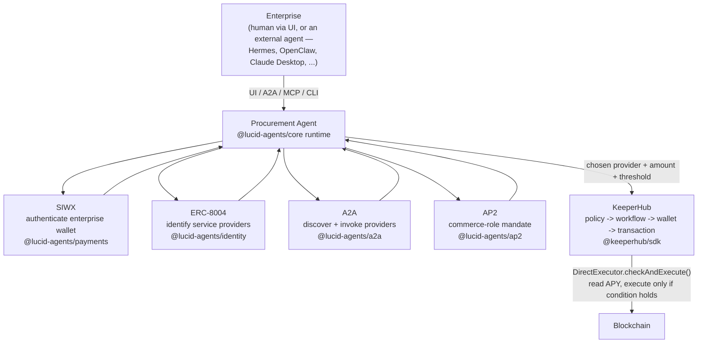

# Enterprise Procurement Agent Platform

**Use case #4 — Enterprise procurement agent**, built on the **Lucid Agents
SDK** (`@lucid-agents/*`) and **KeeperHub** (`@keeperhub/sdk`).

> "Find an agent capable of moving 1M USDC from our treasury to an approved
> lending protocol, but only if APY > 4%."

An enterprise says that once, in plain language. The Procurement Agent
discovers candidate lending-protocol agents over A2A/Agent Cards, checks
their ERC-8004 identity and trust, picks the best one that satisfies the
enterprise's policy, attaches AP2 commerce-role metadata to the purchase, and
hands off to KeeperHub, which independently re-checks the on-chain condition
before it ever signs anything.

**The core split:** Lucid decides *who to buy from*. KeeperHub decides *how
to execute*. Neither one does the other's job.



## Repository layout

| Path | What it is | Docs |
| --- | --- | --- |
| `./app` | Next.js 16 App Router UI + all API routes | [`app/README.md`](app/README.md) |
| `./app/api` | UI-facing convenience routes (`/health`, `/providers`, `/demo/*`) | [`app/README.md`](app/README.md) |
| `./app/api/agent` | **The agent-facing surface.** A2A Agent Card, SIWX-protected entrypoints, ERC-8004/AP2 metadata — this is what an external "Enterprise" agent talks to | [`app/README.md`](app/README.md) |
| `./app/api/agent/mcp` | MCP server exposing the same capabilities as MCP tools | [`app/README.md`](app/README.md) |
| `./app/lib/lucid` | The Procurement Agent's runtime, mock-provider agents, and the discovery/selection pipeline | [`app/README.md`](app/README.md) |
| `./app/lib/keeperhub` | Policy engine + `@keeperhub/sdk` execution adapter | [`app/README.md`](app/README.md) |
| `./agent-skills` | An [Agent Skills](https://agentskills.io/home)-compliant skill teaching an external agent how to use `./app/api/agent` | [`agent-skills/README.md`](agent-skills/README.md) |
| `./agent-skills/scripts/cli` | `procure` CLI (modeled on [moltbook-cli](https://github.com/Moltbook-Official/moltbook-cli)) for agents that can shell out but not craft HTTP/MCP calls | [`agent-skills/README.md`](agent-skills/README.md), [`agent-skills/scripts/cli/README.md`](agent-skills/scripts/cli/README.md) (every command + its `curl` equivalent) |

`./app` and `./agent-skills/scripts/cli` are two independent, self-contained
projects (each with its own `package.json`/`node_modules`) living side by
side in this repo — there is nothing to install or run from the repo root
itself.

## What's real vs. simulated

Every protocol integration below is the actual, installed npm package doing
real work — not a mock of the SDK's shape. The only simulated pieces are
economic data and counterparties this hackathon repo doesn't control:

| Piece | Status |
| --- | --- |
| SIWX challenge/sign/verify (EIP-191 signature, nonce, expiry) | **Real.** `@lucid-agents/payments`. Verified end-to-end against a real signature in this repo's own tests. |
| A2A discovery + invocation (Agent Cards, `quote` skill calls) | **Real.** `@lucid-agents/a2a`, against three small real agent runtimes this repo also hosts (see below). |
| ERC-8004 identity/trust metadata | **Real shape**, statically declared by default (no deployed registry in this demo). Set `AGENT_DOMAIN`/`RPC_URL`/`CHAIN_ID` to switch to live on-chain resolution via `@lucid-agents/identity`. |
| AP2 commerce-role mandate | **Real.** `@lucid-agents/ap2` — `shopper` (this agent) / `merchant` (each provider). |
| KeeperHub execution | **Real SDK, `@keeperhub/sdk`.** Runs against the live KeeperHub API when `KEEPERHUB_API_KEY` is set; otherwise falls back to a same-shaped simulated `DirectExecutor.checkAndExecute()` result (`DEMO_MODE`). |
| The three "lending protocol" providers (Aave/Compound/Morpho gateway agents) | **Simulated economics.** They're real `@lucid-agents/core` A2A agents this repo hosts at `/api/mock-providers/*`, standing in for external counterparties this hackathon doesn't have live deployments of. Their contract addresses are illustrative placeholders on Base Sepolia. |

## Quickstart

```bash
cd app
npm install
cp .env.example .env.local     # every value has a safe DEMO_MODE default
npm run dev                    # http://localhost:3000
```

Open the dashboard, click **Connect & authenticate enterprise wallet**, then
submit the example instruction. Or drive it as an agent would:

```bash
curl http://localhost:3000/api/agent/.well-known/agent-card.json
cd agent-skills/scripts/cli && npm install
node bin/procure.ts submit --instruction "Move 1M USDC to an approved lending protocol, but only if APY > 4%." --amount 1000000
```

## Interaction model

However an "Enterprise" reaches the Procurement Agent — dashboard UI, the
`procure` CLI, raw HTTP, or MCP — it drives the same sequence against
`app/api/agent` (full detail in [`agent-skills/SKILL.md`](agent-skills/SKILL.md)):

| Step | Entrypoint | Auth required | Purpose |
| --- | --- | --- | --- |
| 1. Discover | `GET /api/agent/.well-known/agent-card.json` | none | Read the Agent Card: skills, ERC-8004 trust metadata, AP2 role. |
| 2. Authenticate | `POST /api/agent/entrypoints/authenticate/invoke` | SIWX (401 + challenge, then signed retry) | Prove control of the Enterprise's wallet. No payment, no side effects. |
| 3. Discover providers | `POST /api/agent/entrypoints/discover/invoke` | none | A2A-discover and quote every known provider. No purchase, no KeeperHub call. |
| 4. Check policy | `POST /api/agent/entrypoints/policy/invoke` | none | Read the KeeperHub-enforced policy (max amount, allowed assets/protocols, min APY). |
| 5. Procure | `POST /api/agent/entrypoints/procure/invoke` | SIWX (its own challenge/retry) | The full pipeline: A2A discovery -> ERC-8004 identity -> policy evaluation -> AP2 mandate -> KeeperHub `DirectExecutor.checkAndExecute()` -> execution receipt. |
| 6. Poll | `POST /api/agent/entrypoints/procurement_status/invoke` | none | Look up a previously submitted `ProcurementTask` by id. |

Only steps 2 and 5 require signing. Step 3 decides *who to buy from*;
KeeperHub, invoked internally inside step 5, decides *how to execute* — no
caller, human or agent, talks to KeeperHub directly.

### Server secrets vs. caller secrets

The two credential sets below never mix. An external agent calling in over
HTTP/MCP cannot read, set, or override anything in the app's own `.env` — it
authenticates *to* the app using credentials it holds itself:

| Server-side (`app/.env`) | Caller-side (`agent-skills` CLI / any external agent's own env) |
| --- | --- |
| `DEVELOPER_WALLET_PRIVATE_KEY`, `AGENT_WALLET_PRIVATE_KEY` — the **Procurement Agent's own** operator/signing wallets. | `PROCURE_PRIVATE_KEY` — the **Enterprise's** wallet the caller signs SIWX challenges with. |
| `AGENT_MCP_API_KEY` — the shared secret `app/api/agent/mcp` checks *incoming* requests against. | `PROCURE_MCP_API_KEY` — the same value, held by the caller and sent as `Authorization: Bearer <key>`. |
| `KEEPERHUB_API_KEY` / `KEEPERHUB_BASE_URL` / `KEEPERHUB_EXECUTION_MODE` — the app's own KeeperHub account, used internally inside step 5. | *(none — the caller never talks to KeeperHub directly; it only sees the resulting `ProcurementTask`.)* |

The only value a caller needs to *match* (not replace) is
`AGENT_MCP_API_KEY`/`PROCURE_MCP_API_KEY`. See
[`app/README.md`](app/README.md#server-secrets-vs-caller-secrets) and
[`agent-skills/README.md`](agent-skills/README.md#server-secrets-vs-caller-secrets)
for the same breakdown alongside each project's full env var reference.

## Environment variables (consolidated)

Every value has a working default for `DEMO_MODE` — see
[`app/README.md`](app/README.md#environment-variables) for the full table
with explanations, and [`agent-skills/README.md`](agent-skills/README.md#environment-variables)
for the CLI's own variables.

| Variable | Used by | Default |
| --- | --- | --- |
| `APP_PUBLIC_ORIGIN` | app | `http://localhost:3000` |
| `SIWX_PUBLIC_ORIGIN` | `@lucid-agents/payments` | `http://localhost:3000` |
| `PAYMENTS_RECEIVABLE_ADDRESS`, `PAYMENTS_NETWORK`, `PAYMENTS_FACILITATOR_URL` | `@lucid-agents/payments` | zero address / `eip155:84532` / `https://x402.org/facilitator` |
| `AGENT_DOMAIN`, `RPC_URL`, `CHAIN_ID`, `IDENTITY_AGENT_ID` | `@lucid-agents/identity` | unset -> static trust config |
| `KEEPERHUB_API_KEY`, `KEEPERHUB_BASE_URL` | `@keeperhub/sdk` | unset -> simulated execution |
| `AGENT_MCP_API_KEY` | `./app/api/agent/mcp` | unset -> open (local dev) |
| `POLICY_MAX_USD_PER_TASK`, `POLICY_MIN_APY_BPS`, `POLICY_ALLOWED_ASSETS`, `POLICY_ALLOWED_PROTOCOLS` | policy engine | `1000000` / `400` / `USDC` / `aave-v3,compound-v3,morpho` |
| `PROCURE_BASE_URL`, `PROCURE_PRIVATE_KEY`, `PROCURE_MCP_API_KEY` | `procure` CLI | `http://localhost:3000` / none (ephemeral signer) / none |

## Further reading

- [`app/README.md`](app/README.md) — UI + API architecture, sequence diagram, interaction model, module table, full env var table.
- [`agent-skills/README.md`](agent-skills/README.md) — the Agent Skills package and CLI, for teaching an external agent how to behave against this app.
- [`agent-skills/scripts/cli/README.md`](agent-skills/scripts/cli/README.md) — every `procure` CLI command paired with the raw `curl` command it's equivalent to.
