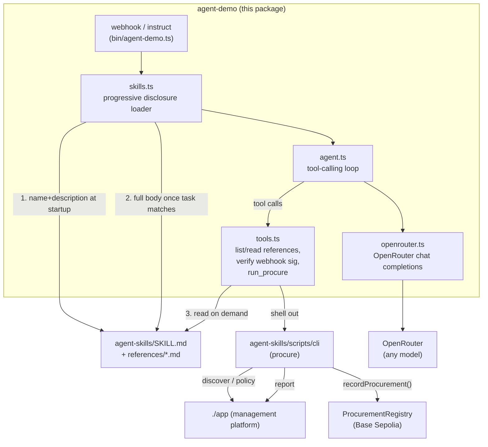
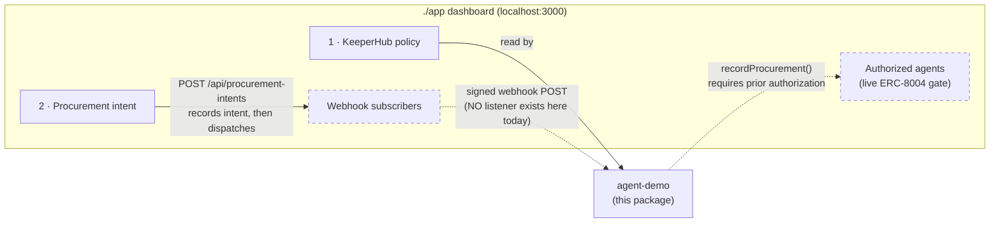
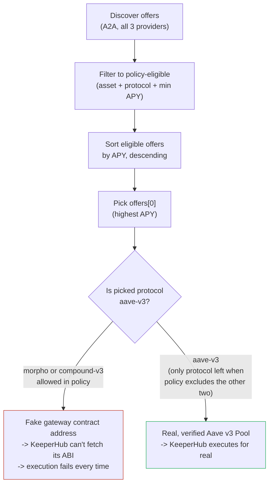
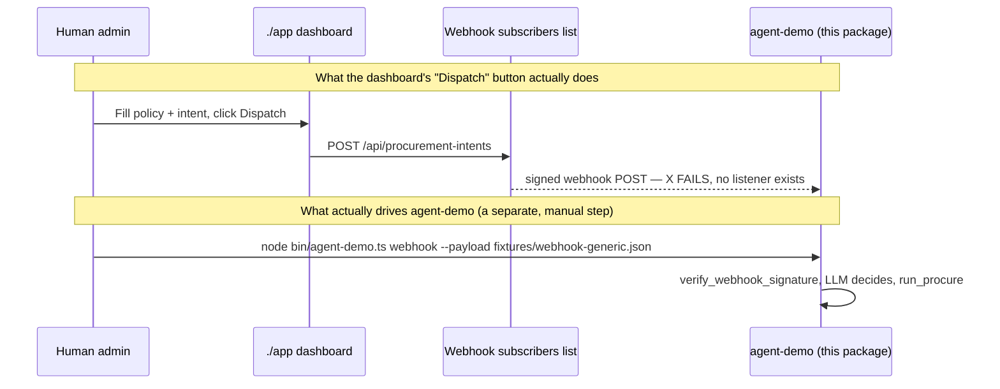
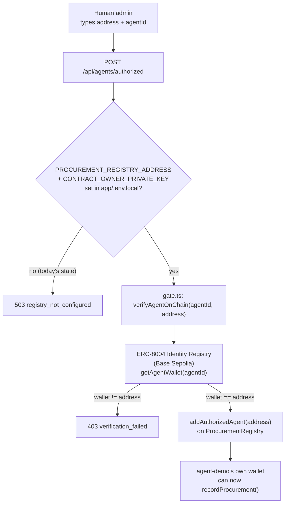
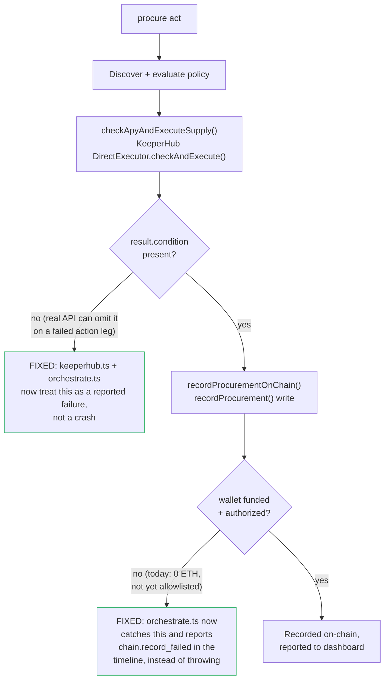

# `./agent-demo` — a demo external agent (stands in for Hermes Agent / OpenClaw)

`./agent-skills` teaches *any* external agent how to act as the Enterprise's
procurement actor. `./agent-skills/scripts/cli` (`procure`) is a
deterministic, no-LLM reference implementation of that behavior — useful for
testing, but it doesn't actually *decide* anything; every step is hard-coded.

**This package is the missing piece: a real, LLM-driven agent that plays the
same actor/role a live Hermes Agent or OpenClaw install would.** It has no
special, hard-coded knowledge of this platform. At startup it only loads
`./agent-skills/SKILL.md`'s `name` + `description`, exactly like a real
skills-compatible runtime would; once a task (a webhook, or a human's
natural-language ask) matches, it reads the full `SKILL.md` body itself, an
LLM (reached over **OpenRouter** — <https://openrouter.ai/docs/quickstart>)
decides what to do, and it reads `references/*.md` on demand and shells out
to the bundled `procure` CLI to actually act — the same "fastest path" the
skill itself documents. `./agent-skills` and `./app` don't know or care that
this is what's on the other end of the webhook; a real Hermes Agent or
OpenClaw install slots in at exactly the same place.



## Why an LLM at all, if `procure` already does the whole pipeline?

`procure submit`/`act` already implement discovery-read, policy evaluation,
KeeperHub execution, the on-chain write, and reporting — deterministically.
What they *don't* do is decide **whether and how to act in the first
place**, which is the actual job description in `agent-skills/SKILL.md`:
verify an inbound webhook's signature before trusting it, tell apart
Hermes's flat JSON from OpenClaw's TaskFlow `goal` string (which folds
structured fields into free text — see
[`agent-skills/references/protocols.md`](../agent-skills/references/protocols.md#webhook-signing-how-you-receive-an-intent)),
parse a human's plain-English ask ("Move 2 USDC... only if APY > 1%") into
the right flags, and read the right reference doc on demand instead of
having every protocol detail hard-coded. That reasoning is what a real
Hermes Agent or OpenClaw install brings via its own LLM — this package
brings the same thing via OpenRouter, so the demo shows an agent *deciding*
to run `procure`, not a script that always does.

## Install

Written in TypeScript, run directly via Node 22.6+'s native TS stripping —
no build step, same as `agent-skills/scripts/cli`.

```bash
cd agent-demo
npm install
cp .env.example .env   # fill in OPENROUTER_API_KEY at minimum
node bin/agent-demo.ts skills
```

## Commands

| Command | Description |
| --- | --- |
| `agent-demo skills` | Loads only `agent-skills/SKILL.md`'s `name` + `description` and prints them, plus the list of `references/*.md` available on demand — step 1 of progressive disclosure, with no LLM call. |
| `agent-demo webhook --platform <hermes\|openclaw\|generic> --payload <file\|-> [--secret <secret>]` | Simulates this agent receiving a signed webhook on the given platform's route (see `fixtures/webhook-*.json` for one example payload per platform) and reasoning over it end to end. The command signs the payload itself first, exactly the way `./app`'s dispatcher would (`app/lib/webhooks/dispatch.ts`), then hands the signed request to the agent loop, which independently re-verifies it with the same secret via its own `verify_webhook_signature` tool — so the full sign/verify round trip is demonstrated without needing a live `./app` instance running the dispatch side. |
| `agent-demo instruct "<text>"` | Simulates a human enterprise admin telling this agent directly, no webhook involved — e.g. `agent-demo instruct "Move 2 USDC to an approved lending protocol, but only if APY > 1%."` |

Every run logs each step to stdout: which skill loaded, each LLM turn, every
tool call and its result, and the LLM's final natural-language report.

### Example

```bash
node bin/agent-demo.ts webhook --platform generic --payload fixtures/webhook-generic.json --secret demo-secret
```

```
[skill] loaded at startup: "agent-skills" — Teaches an external enterprise agent...
[skill] task matches this skill's description -> activating, reading full SKILL.md body
[llm] calling openai/gpt-4o-mini via OpenRouter (turn 1/12)
[llm] requested tool call: verify_webhook_signature({"platform":"generic",...})
[tool] verify_webhook_signature(platform=generic)
[llm] calling openai/gpt-4o-mini via OpenRouter (turn 2/12)
[llm] requested tool call: run_procure({"command":"act","stdin":"..."})
[tool] run_procure act
[llm] calling openai/gpt-4o-mini via OpenRouter (turn 3/12)
[llm] final report:
Verified the webhook signature, then ran the procurement pipeline via `procure act`...
```

(`run_procure`'s actual result depends on a running `./app` instance and
whatever `PROCURE_*` credentials are configured — see below. With none
configured, `procure` still runs end to end in its own graceful-degradation
modes: KeeperHub demo mode, a throwaway signer, and the on-chain write
skipped, per `agent-skills/README.md`.)

## How it works

1. **Progressive disclosure, for real.** `src/skills.ts` is a small,
   dependency-free reader for the [Agent Skills
   format](https://agentskills.io/specification) — it reads only `name` +
   `description` at "startup" (`agent-demo skills`), the full `SKILL.md`
   body once a trigger arrives, and `references/*.md` files only when the
   LLM asks for them via a tool call. Nothing about `./agent-skills`' actual
   content is hard-coded into this package's prompts.
2. **The LLM decides, via OpenRouter.** `src/openrouter.ts` is a ~50-line
   client for OpenRouter's OpenAI-compatible `/chat/completions` endpoint
   (tool calling included) — no vendor SDK, matching this repo's
   dependency-light CLI style. `src/agent.ts` runs the tool-calling loop:
   system prompt (persona + the full `SKILL.md` body) -> user message
   (the webhook or natural-language trigger) -> the LLM either calls a tool
   or gives its final report.
3. **Acting still goes through `procure`.** `src/tools.ts`'s `run_procure`
   tool shells out to `agent-skills/scripts/cli/bin/procure.ts` — discovery,
   policy evaluation, KeeperHub execution, the on-chain receipt write, and
   reporting are that CLI's job, not reimplemented here. This package's own
   job is strictly the reasoning Hermes/OpenClaw would otherwise supply:
   verifying the webhook, picking which `procure` command/flags to use, and
   narrating the outcome.
4. **Webhook signature verification is real**, per
   [`agent-skills/references/protocols.md`](../agent-skills/references/protocols.md#webhook-signing-how-you-receive-an-intent):
   Hermes's `X-Webhook-Signature-V2` + `X-Webhook-Timestamp` HMAC pair,
   OpenClaw's `Authorization: Bearer <secret>`, and the generic
   `X-Procurement-Signature-256` HMAC — `src/tools.ts`'s
   `verify_webhook_signature` tool implements all three with a
   constant-time comparison.

## Persona

`AGENT_DEMO_PERSONA` (`hermes` | `openclaw` | `generic`) changes only the
system prompt's self-identification and the trigger's framing — the actual
behavior (read skill, decide, act via `procure`) is identical, which is the
point: this package is meant to be a drop-in stand-in for whichever real
agent runtime you're demoing against.

## Environment variables

| Variable | Purpose | Default |
| --- | --- | --- |
| `OPENROUTER_API_KEY` | Required. From <https://openrouter.ai/keys>. | — |
| `OPENROUTER_MODEL` | Any model slug OpenRouter routes to (e.g. `openai/gpt-4o-mini`, `anthropic/claude-3.7-sonnet`). | `openai/gpt-4o-mini` |
| `OPENROUTER_BASE_URL` | OpenRouter API base URL. | `https://openrouter.ai/api/v1` |
| `OPENROUTER_SITE_URL`, `OPENROUTER_APP_NAME` | Sent as `HTTP-Referer` / `X-Title` — OpenRouter uses these for dashboard attribution/rankings. | `http://localhost:3000` / `agent-demo` |
| `AGENT_DEMO_PERSONA` | `hermes` \| `openclaw` \| `generic` — which real agent runtime this run role-plays as. | `generic` |
| `AGENT_DEMO_NAME` | Display name used in the system prompt. | `Demo External Agent` |
| `AGENT_DEMO_MAX_TOOL_ITERATIONS` | Safety cap on the tool-calling loop. | `12` |
| `AGENT_SKILLS_DIR` | Override the path to `./agent-skills` (defaults to the sibling directory). | `../agent-skills` |
| `PROCURE_CLI_BIN` | Override the path to `procure`'s `bin/procure.ts` (defaults to the bundled one). | `../agent-skills/scripts/cli/bin/procure.ts` |
| `DEMO_WEBHOOK_SECRET` | Default `--secret` for the `webhook` command. | `demo-secret` |
| `PROCURE_BASE_URL`, `PROCURE_PRIVATE_KEY`, `PROCURE_MCP_API_KEY`, `PROCURE_KEEPERHUB_API_KEY`, `PROCURE_KEEPERHUB_BASE_URL`, `PROCURE_KEEPERHUB_EXECUTION_MODE`, `PROCURE_REGISTRY_ADDRESS`, `PROCURE_RPC_URL` | Passed straight through (inherited process env) to the shelled-out `procure` CLI — same variables, same meaning as [`agent-skills/README.md#environment-variables`](../agent-skills/README.md#environment-variables). This agent never reads or holds these itself; it only launches a process that does. | see `agent-skills/README.md` |

## Wiring `./app`'s dashboard UI to this demo agent

`./app` (`http://localhost:3000`) has four panels on its dashboard for
driving a procurement intent end to end. Only two of them are live-wired to
this package as shipped; the other two need setup beyond typing a value into
a form. This section is the concrete "what do I type where" reference.



### Panel-by-panel

| # | Panel | Reaches `agent-demo`? | What to enter today |
| --- | --- | --- | --- |
| 1 | **KeeperHub policy** | Indirectly — this agent fetches it read-only via `GET /api/agent/entrypoints/policy/invoke` once it acts. | Already seeded from `app/.env.local`: Max USD/task `2`, Min APY `1.00`, Allowed assets `USDC`, Allowed protocols `aave-v3` only. Matches `fixtures/webhook-generic.json` — leave as-is. |
| 2 | **Procurement intent** | Only via panel 3's dispatch — doesn't execute anything itself. | Instruction `Move 2 USDC from our treasury to an approved lending protocol, but only if APY > 1%.`, Asset `USDC`, Amount `2`, Min APY `1.0` (all defaults). |
| 3 | **Webhook subscribers** | **No** — see below. | N/A as a live wire; see the two-step flow below instead. |
| 4 | **Authorized agents** | N/A (this is `./app` gating *incoming* on-chain writes from any agent, not something this package calls) | Needs real on-chain setup before it accepts anything meaningful — see below. |

### Why "Allowed protocols" is restricted to `aave-v3`

The policy's `allowedProtocols` seed intentionally excludes `compound-v3`
and `morpho`, even though `./app` still discovers all three as candidate
providers. This isn't a preference — it's required for a run to ever reach
a successful KeeperHub execution.

| Protocol | Seeded APY (`app/lib/lucid/mock-providers.ts`) | Contract on Base Sepolia | Included in policy? |
| --- | --- | --- | --- |
| `morpho` | 5.60% (highest) | **Fake/illustrative** address — no real deployment exists to point to | No |
| `compound-v3` | 4.80% | **Fake/illustrative** address — no usable Base Sepolia testnet deployment (confirmed against Compound's own repos/APIs) | No |
| `aave-v3` | 3.20% (lowest) | **Real, verified** Aave v3 Pool proxy (from `aave-dao/aave-address-book`) | **Yes** |

The reason this matters is the CLI's offer-selection order in
[`agent-skills/scripts/cli/src/orchestrate.ts`](../agent-skills/scripts/cli/src/orchestrate.ts) —
it sorts every *policy-eligible* offer by APY, descending, and executes
against whichever comes out on top:



Because the selection logic always prefers the highest APY among whatever
the policy allows, leaving `compound-v3`/`morpho` in `allowedProtocols`
means they win the sort (5.60% / 4.80% > Aave's 3.20%) and the run reaches
KeeperHub only to fail fetching an ABI for an address that was never a real
contract. Restricting the policy to `allowedProtocols=aave-v3` removes them
from the eligible set entirely, so the sort has only one candidate left —
the one gateway with a real, verified Base Sepolia contract — and the run
can complete the KeeperHub step instead of failing on it deterministically.

### Why "Webhook subscribers" doesn't reach `agent-demo`

`agent-demo` has **no HTTP listener**. Its `webhook` command only
*simulates* receiving a signed POST by reading a local JSON file
(`bin/agent-demo.ts`) — there is no server-side route to type a URL for.
Whatever URL you put in the dashboard's "Webhook subscribers" panel, the
UI's dispatch will attempt to POST to it and get nothing back, because
nothing is listening.



The demo is intentionally **two decoupled steps**, not a live UI-click-to-agent
wire:

| Step | Where | Command / action |
| --- | --- | --- |
| 1 | `./app` dashboard | Set policy + describe the intent (leave "Webhook subscribers" empty — you'll see "no active webhook subscribers to dispatch to", which is expected). |
| 2 | `agent-demo/` (separate terminal) | `node bin/agent-demo.ts webhook --platform generic --payload fixtures/webhook-generic.json --secret demo-secret` — signs the payload the same way `app/lib/webhooks/dispatch.ts` would, then feeds it to the agent loop, which independently re-verifies the signature and decides whether/how to act. |

To make step 3 a *real*, live wire (dashboard click -> `agent-demo` wakes up
automatically), you'd need to add a small HTTP receiver in front of this
package — not part of this repo today — that accepts the dashboard's POST,
writes the body to a temp file, and shells out to
`node bin/agent-demo.ts webhook --payload <that file> --secret <shared secret>`.

### "Authorized agents (live ERC-8004 gate)" — what's required first

This panel isn't a free-text field either: `POST /api/agents/authorized`
runs a **live on-chain check** (`app/lib/identity/gate.ts`) that the
`agentId` you enter really resolves, on the ERC-8004 Identity Registry
(Base Sepolia), to the wallet `address` you enter — only then does it get
added to `ProcurementRegistry`'s on-chain allowlist.



| Requirement | Current state | Needed to unblock |
| --- | --- | --- |
| `PROCUREMENT_REGISTRY_ADDRESS` in `app/.env.local` | **Missing** — panel returns `503` | Set to the deployed contract, `0xDf33FdF3360fCF1923aBb8C7e3cE3c51160c7623` (see root [`README.md`](../README.md#deployed-contracts)). |
| `CONTRACT_OWNER_PRIVATE_KEY` in `app/.env.local` | **Missing** | Set to the key that deployed/owns `ProcurementRegistry.sol` — administers the allowlist only, never touches treasury funds. |
| `PROCURE_PRIVATE_KEY` in `agent-demo/.env` | **Set** (a fixed EOA, not a throwaway-per-run key) | Needs Base Sepolia ETH for gas — see the troubleshooting section below; it has none yet. |
| An `agentId` registered to that wallet on the ERC-8004 Identity Registry | **Does not exist yet** | Register via `@lucid-agents/identity` (see its `README.md` — `createAgentIdentity` / the `identity()` runtime extension) against `PROCURE_PRIVATE_KEY`'s wallet; the resulting `agentId` + wallet address are what you type into the dashboard's "Authorized agents" form. |

Until all four rows are done, the "Authorized agents" panel — and therefore
`agent-demo`'s (or `procure`'s) on-chain `recordProcurement()` write and its
`report/invoke` call — will fail.

## Troubleshooting: a live `webhook`/`instruct` run exhausts its tool-call budget

A real run against this package's own env (a configured `PROCURE_KEEPERHUB_API_KEY`
and `PROCURE_REGISTRY_ADDRESS`, both already set in `agent-demo/.env`) can fail
with `✗ Exceeded maxToolIterations (12) without a final report from the LLM.` —
the LLM never crashes outright, but `run_procure act`/`submit` keeps handing it
an unrecoverable error, so it flails (re-checking config, retrying with
different args) instead of reporting a clean failure. This section is the
result of actually tracing that failure end to end, including two code fixes
already applied in this repo.

### It's not the wallet type

The first hypothesis was that KeeperHub's ["Agentic Wallet"](https://docs.keeperhub.com/agent/agentic-wallet)
(`@keeperhub/wallet`, Turnkey-backed) should replace `PROCURE_PRIVATE_KEY`.
Inspecting the actual package (`npm pack @keeperhub/wallet` and reading its
`dist/index.d.ts`) ruled that out:

| Fact | Detail |
| --- | --- |
| What it's actually for | Its own `package.json` description: *"auto-pay x402 and MPP 402 responses with a server-side Turnkey proxy"* — an agent-IDE hook (Claude Code/Cursor/etc.) that auto-pays HTTP `402 Payment Required` challenges, not a general contract-call signer. |
| Its exported API | `createPaymentSigner`, `parseX402Challenge`, `parseMppChallenge`, `checkBalance`, `fund()`, `createPreToolUseHook()` — nothing resembling `signTransaction`/`signMessage` for an arbitrary contract call. |
| Chains it supports | Base **mainnet** (8453) and Tempo only — **not Base Sepolia** (84532), where `ProcurementRegistry` and the Aave v3 gateway actually live. |

`ProcurementRegistry.recordProcurement()` also checks `msg.sender` directly
([`contracts/src/ProcurementRegistry.sol:87`](../contracts/src/ProcurementRegistry.sol#L87)),
so whatever wallet calls it must itself be on the allowlist — a raw EOA via
`PROCURE_PRIVATE_KEY` is the correct mechanism here, not a replacement to fix.

### The two real bugs (both fixed)

Tracing one real, non-demo-mode `procure act` call (`PROCURE_KEEPERHUB_API_KEY`
and `PROCURE_REGISTRY_ADDRESS` both set — the same env this package already
ships) surfaced two separate unhandled-exception bugs, each one enough on its
own to crash the whole pipeline and derail the LLM's tool loop:



| # | Bug | Where | Symptom before the fix | Fix |
| --- | --- | --- | --- | --- |
| 1 | KeeperHub's real `checkAndExecute` can return a result with no `condition` field (e.g. the action leg errored) even though the SDK's TypeScript type declares it as always present. | [`agent-skills/scripts/cli/src/keeperhub.ts`](../agent-skills/scripts/cli/src/keeperhub.ts) (`condition: { met: result.condition.met, ... }`) and [`orchestrate.ts`](../agent-skills/scripts/cli/src/orchestrate.ts) (`execution.condition!.met`) | `{"error":"Cannot read properties of undefined (reading 'met')"}` — an uncaught `TypeError` crashing the whole `act`/`submit` call. | Both now check for a missing `condition` and report a clean `keeperhub.execution_failed` timeline entry (with the API's own `raw` error attached) instead of throwing. |
| 2 | `recordProcurementOnChain()`'s write call had no try/catch, so any revert (unfunded wallet, not-yet-authorized wallet, RPC error) propagated uncaught. | [`agent-skills/scripts/cli/src/orchestrate.ts`](../agent-skills/scripts/cli/src/orchestrate.ts) (`reportAndMaybeRecord`) | A viem revert (e.g. `gas required exceeds allowance (0)`) crashed the whole command instead of the task completing with a reported failure. | Now wrapped in try/catch; a failure is pushed as a `chain.record_failed` timeline entry and the rest of the pipeline (dashboard report attempt) still runs. |

Verified with a real (non-demo) `procure act` call after both fixes: the CLI
now returns a complete, valid JSON task instead of crashing — status
`"completed"` for the KeeperHub leg, with the on-chain write's failure
recorded cleanly in the timeline rather than throwing.

### What's still open (not yet fixed, by design — see the questions above)

Diagnosing this surfaced three separate, still-open issues — none of them
about the wallet *type*:

| # | Issue | Evidence |
| --- | --- | --- |
| 1 | The Aave v3 `supply()` call is ambiguous to KeeperHub's auto-fetched ABI. | Real API response: `"Function 'supply' matches 2 overloads in this ABI, so the one to call cannot be determined... supply(address,uint256,address,uint16), supply(bytes32)"`. [`app/lib/lucid/mock-providers.ts`](../app/lib/lucid/mock-providers.ts)'s `aave-v3-gateway.supplyContract` calls it by bare name with no explicit `abi`. |
| 2 | `PROCURE_PRIVATE_KEY`'s wallet (`test_opera_1`) has **0 Base Sepolia ETH**. | Real revert: `gas required exceeds allowance (0)` from `recordProcurement()`. |
| 3 | That wallet also isn't yet on `ProcurementRegistry`'s `authorizedAgents` allowlist. | Blocked upstream of that — `app/.env.local` is still missing `PROCUREMENT_REGISTRY_ADDRESS`/`CONTRACT_OWNER_PRIVATE_KEY` (see the "Authorized agents" table above), so the dashboard panel that would authorize it can't run yet either. |

Notably, KeeperHub's real API call in this trace *did* succeed at its own
job — it read Aave's on-chain rate and confirmed the liveness condition
(`"conditionResult":{"met":true,...}`) — so the org's KeeperHub execution
wallet itself is funded and working. The remaining failures are specific,
addressable bugs/config gaps, not a wallet-architecture problem.

## Relationship to `./agent-skills/scripts/cli`

| | `agent-skills/scripts/cli` (`procure`) | `agent-demo` (this package) |
| --- | --- | --- |
| Role | The actor's mechanical implementation — discovery read, policy evaluation, KeeperHub execution, on-chain write, reporting. | The actor's *decision layer* — what a real Hermes Agent/OpenClaw install supplies around that mechanism. |
| Driven by | CLI flags / a webhook JSON file, deterministically. | An LLM (via OpenRouter), reasoning over `agent-skills/SKILL.md` at runtime. |
| Knows about `./agent-skills`' content? | No — it's the thing the skill *describes*, not a reader of the skill file. | Yes — reads `SKILL.md` + `references/*.md` itself, live, the same way a real agent would. |
| Used by | Both `agent-demo`'s `run_procure` tool, and directly by any human/automation (see `agent-skills/README.md`). | — |

See [`../agent-skills/README.md`](../agent-skills/README.md) for the skill
package and CLI this agent drives, and [`../README.md`](../README.md) for
the project-level architecture.
