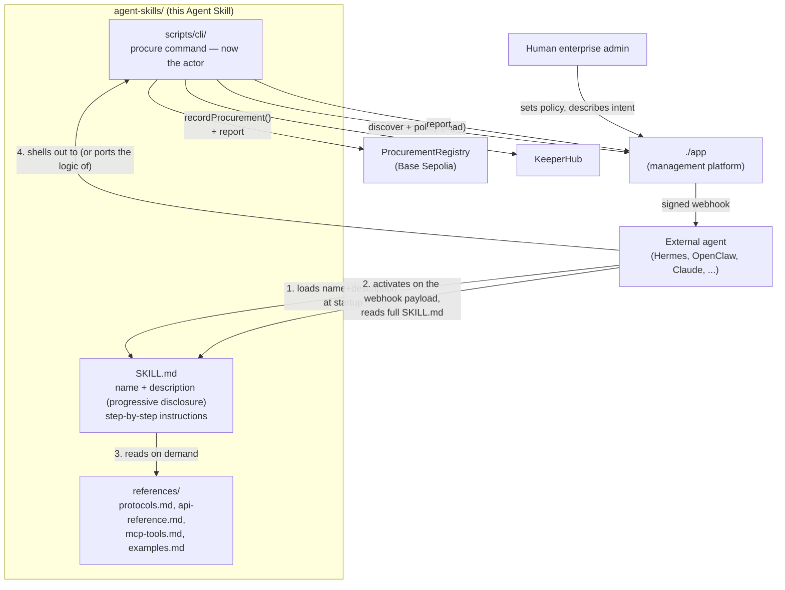
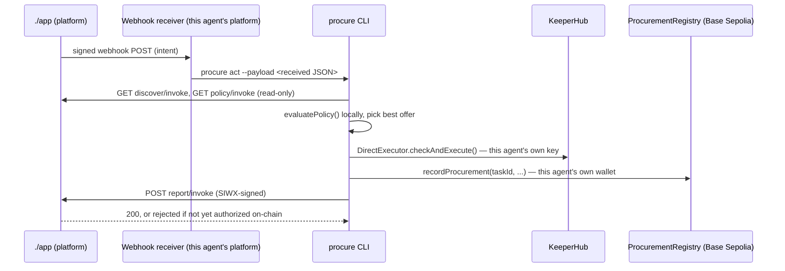
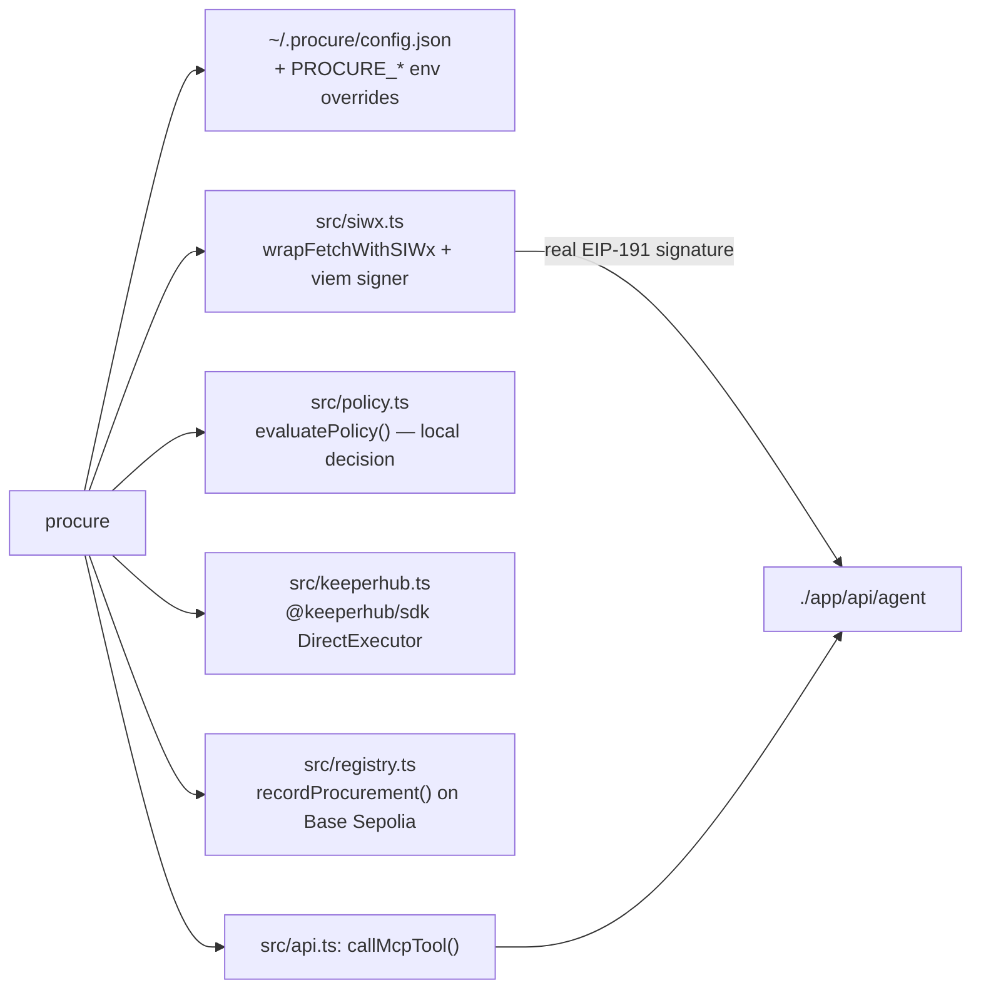

# `./agent-skills` — teaching an external agent to be the procurement actor

This is an [Agent Skills](https://agentskills.io/home)-format package: a
portable, version-controlled folder that tells any skills-compatible agent
(Claude, Hermes Agent, OpenClaw, or a custom framework) how to act as the
Enterprise's procurement actor — reacting to a webhook-dispatched intent from
`./app`'s dashboard, discovering candidate providers, evaluating policy,
executing via its own KeeperHub key, recording the receipt on-chain, and
reporting back — without that agent needing to read this repo's source code.

**`./app` is not the actor.** It's the enterprise's management platform: a
human admin sets policy and describes intents there; this skill is what
turns a dispatched webhook into an actual, executed, on-chain-recorded
procurement.



## Why this structure

Per the [Agent Skills specification](https://agentskills.io/specification),
a skill loads progressively: an agent sees only `name` + `description` for
every installed skill at startup (cheap), reads the full `SKILL.md` body only
once a task matches (moderate), and loads `references/*` files only as
needed (expensive, on demand). This package follows that shape exactly:

| File/dir | Loaded when | Contents |
| --- | --- | --- |
| `SKILL.md` frontmatter (`name`, `description`) | Always, at agent startup | ~100 tokens: what this skill is for and when to use it. |
| `SKILL.md` body | Once a webhook (or a human's natural-language request) matches | The step-by-step procedure: receive intent -> discover -> read policy -> evaluate -> execute -> record on-chain -> report -> poll. |
| `references/protocols.md` | Implementing SIWX/A2A/ERC-8004/AP2/KeeperHub/webhook-signing by hand | Wire formats, captured from this app's and each webhook platform's real behavior. |
| `references/api-reference.md` | Calling the HTTP surface | Every entrypoint, request/response shapes. |
| `references/mcp-tools.md` | Using an MCP client | Tool list (read-only), schemas, the MCP trust-boundary note. |
| `references/examples.md` | Wanting a worked transcript | Real accepted/rejected/webhook-triggered runs. |
| `scripts/cli/` | Can shell out but not craft HTTP calls / on-chain writes itself | The `procure` command (below) — now does discovery-read, policy evaluation, KeeperHub execution, and the on-chain receipt write, not just HTTP plumbing. |

## Interaction model



| Step | How | Auth / credentials | Purpose |
| --- | --- | --- | --- |
| Receive the intent | A webhook POST from `./app` (Hermes route / OpenClaw plugin / generic) | Platform-specific signature (HMAC or Bearer) — verify it before acting | This is the trigger. No polling. |
| Discover this agent | `GET /api/agent/.well-known/agent-card.json` | none | A2A Agent Card, ERC-8004 trust metadata, AP2 role. |
| Discover providers (read) | `POST /api/agent/entrypoints/discover/invoke` | none | Platform-hosted market data — who's available to buy from. |
| Read policy | `POST /api/agent/entrypoints/policy/invoke` | none | The enterprise's current, admin-set policy. |
| **Evaluate + execute** | Local, in `procure submit`/`act` | This agent's own `PROCURE_KEEPERHUB_API_KEY` | `evaluatePolicy()` picks the best eligible offer; `DirectExecutor.checkAndExecute()` runs the guarded on-chain call. **`./app` never sees these credentials or this call.** |
| **Record on-chain** | `ProcurementRegistry.recordProcurement(...)` | This agent's own `PROCURE_PRIVATE_KEY`, and the address must already be on the contract's `authorizedAgents` allowlist | The durable receipt. Reverts if this agent hasn't been authorized yet (see below). |
| **Report** | `POST /api/agent/entrypoints/report/invoke` | SIWX (same `PROCURE_PRIVATE_KEY`) + the platform's live on-chain ERC-8004 gate | Files the rich detail (timeline, policy evaluation) for the dashboard, keyed by the same `taskId` as the on-chain receipt. |
| Poll | `POST /api/agent/entrypoints/procurement_status/invoke` | none | Look up a previously reported task by id. |

**Before any of this works, the enterprise admin must authorize this
agent's wallet** via the dashboard's "Authorized agents" panel
(`POST /api/agents/authorized`), which runs a live ERC-8004 verification
(this agent's `agentId` must resolve, on-chain, to this agent's wallet
address) before adding it to `ProcurementRegistry`'s allowlist. Without that,
both the on-chain write and the `report` call fail.

## Registering a webhook route (done on your own platform, not here)

Neither Hermes Agent nor OpenClaw lets a remote caller register a webhook
route over their API — `./app` can only dispatch to a URL/secret you already
configured on your own instance. Give the enterprise admin that URL +
secret to add via the dashboard's "Webhook subscribers" panel, and do this
on your side first:

| Platform | How you register a route | What `./app` will POST |
| --- | --- | --- |
| **Hermes Agent** | `hermes webhook subscribe <route-name> --events procurement_intent --prompt "..."` (or a static `platforms.webhook.extra.routes` entry in `~/.hermes/config.yaml`) — see [Hermes' webhook docs](https://hermes-agent.nousresearch.com/docs/user-guide/messaging/webhooks). Your `--prompt` template can reference `{instruction}`, `{asset}`, `{amount}`, `{minApyBps}`, `{taskId}`, `{policy}` by dot-notation. | `POST http://<your-host>:8644/webhooks/<route-name>`, signed `X-Webhook-Signature-V2` + `X-Webhook-Timestamp` (HMAC-SHA256 over `${timestamp}.${body}`, using the secret you set in the dashboard). |
| **OpenClaw** | Configure a `plugins/webhooks` route with a `secret` — see [OpenClaw's webhook plugin docs](https://docs.openclaw.ai/plugins/webhooks). | `POST https://<your-gateway>/plugins/webhooks/<routeId>`, `Authorization: Bearer <secret>`, body is a TaskFlow action: `{"action":"create_flow","goal":"<instruction + taskId/asset/amount/minApyBps>","status":"queued","notifyPolicy":"done_only"}` (OpenClaw rejects unknown fields, so structured data is folded into `goal`). |
| **Generic** | Anything that can receive a signed POST. | `POST <your-url>`, `X-Procurement-Signature-256: sha256=<hmac>` (GitHub-style, HMAC-SHA256 over the raw body), full JSON: `{taskId, instruction, asset, amount, minApyBps, allowedProtocols, policy, enterpriseId}`. This is what `procure act` (below) expects. |

Whatever your webhook automation does with the received payload, the
simplest integration is to shell out to `procure act` (or call
`requestFromWebhookPayload` + `runProcurementLocally` directly from
`agent-skills/scripts/cli/src/orchestrate.ts` if you're embedding this in
your own agent runtime rather than shelling out).

## Server secrets vs. caller secrets

`./app`'s own `.env` (see [`../app/README.md`](../app/README.md#environment-variables))
and this CLI's config/env vars (below) are two entirely separate credential
sets that never mix. **`./app` no longer holds a treasury key or a
KeeperHub key at all** — this agent is the only party that does:

| Platform-side (`app/.env`) | Actor-side (`~/.procure/config.json` / `PROCURE_*` env — this agent's own) |
| --- | --- |
| `CONTRACT_OWNER_PRIVATE_KEY` — administers the on-chain `authorizedAgents` allowlist only, after a live ERC-8004 check. Never used for treasury funds. | `PROCURE_PRIVATE_KEY` — this agent's own wallet: signs SIWX *and* writes the on-chain receipt. |
| `AGENT_MCP_API_KEY` — the shared secret `app/api/agent/mcp` checks *incoming* requests against. | `PROCURE_MCP_API_KEY` — the same value, sent as `Authorization: Bearer <key>`. |
| `RPC_URL` / `PROCUREMENT_REGISTRY_ADDRESS` — read-only chain queries + the gate's registry lookups. | `PROCURE_KEEPERHUB_API_KEY` / `PROCURE_KEEPERHUB_BASE_URL` / `PROCURE_KEEPERHUB_EXECUTION_MODE` — **this agent's own** KeeperHub org credentials. `./app` never sees these. |
| *(nothing else — no treasury key, no KeeperHub key)* | `PROCURE_REGISTRY_ADDRESS` / `PROCURE_RPC_URL` — same `ProcurementRegistry` contract, used to broadcast the write. |

The only value that needs to *match* (not be issued by the platform) is
`AGENT_MCP_API_KEY`/`PROCURE_MCP_API_KEY`, for MCP auth. Everything else —
SIWX signature, on-chain wallet, KeeperHub org — is this agent's own, held
only here, never on the platform.

## The `procure` CLI

Modeled on [moltbook-cli](https://github.com/Moltbook-Official/moltbook-cli)
(the reference CLI for [Moltbook](https://github.com/Moltbook-Official/moltbook),
"the social network for AI agents"): a small dependency-light Node CLI, one
subcommand per capability, a `--json` flag on every command for
machine-readable output, and config resolved from a dotfile with env-var
overrides — same shape, applied to procurement instead of social posting.
It has since grown from a thin HTTP client into the actual actor: `submit`
and `act` now run discovery-read, local policy evaluation, KeeperHub
execution, and the on-chain receipt write, not just an HTTP call.



### Install

Written in TypeScript, run directly via Node 22.6+'s native TS stripping —
no build step.

```bash
cd agent-skills/scripts/cli
npm install
node bin/procure.ts status
# or, to use `procure` as a bare command:
npm link
```

### Commands

| Command | Description |
| --- | --- |
| `procure status` | Health-check the platform + show this CLI's resolved config. |
| `procure card [providerId]` | Fetch the platform's own Agent Card, or a provider's, by id. |
| `procure discover` | A2A discovery preview (no auth, no purchase) — platform-hosted market data. |
| `procure policy` | Show the enterprise's current, admin-editable policy. |
| `procure auth` | Sign a SIWX challenge and verify the round trip. |
| `procure submit --instruction <text> --amount <n> [--asset USDC] [--min-apy 4.0] [--protocol <name...>]` | **Run the full pipeline locally**: discover + read policy from the platform, evaluate policy, execute via this agent's own KeeperHub key, write the on-chain receipt, report to the dashboard. |
| `procure act [--payload <file\|->]` | Same pipeline as `submit`, but reads a webhook-shaped JSON payload (file or stdin) instead of CLI flags — the command to shell out to from a Hermes prompt-triggered tool or an OpenClaw `run_task` action. |
| `procure task <taskId>` | Look up a previously reported task by id. |
| `procure mcp-call <toolName> [jsonArgs]` | Call a read-only tool on `./app/api/agent/mcp` directly. |
| `procure config get` / `procure config set <key> <value>` | Read/write `~/.procure/config.json`. |

Every command accepts `--json` for strict, single-line machine-readable
output (no summary line, no pretty-printing) — the same convention
`moltbook-cli` uses so an agent can parse output reliably.

### Environment variables

| Variable | Purpose | Default |
| --- | --- | --- |
| `PROCURE_BASE_URL` | Base URL of the running platform | `http://localhost:3000` |
| `PROCURE_PRIVATE_KEY` | This agent's own signing key (EOA private key, `0x...`) — used for SIWX auth **and** the on-chain `recordProcurement` write | unset -> a throwaway key is generated per invocation (a warning is printed; it will not be authorized on-chain) |
| `PROCURE_MCP_API_KEY` | Sent as `Authorization: Bearer <key>` to `/api/agent/mcp` if the platform requires it | unset |
| `PROCURE_CHAIN_ID` | Bare chain id used to build the CAIP-2 id offered during SIWX | `84532` |
| `PROCURE_KEEPERHUB_API_KEY` | This agent's own KeeperHub organization key | unset -> KeeperHub demo mode (simulated `checkAndExecute`) |
| `PROCURE_KEEPERHUB_BASE_URL` | KeeperHub API base URL | `https://app.keeperhub.com` |
| `PROCURE_KEEPERHUB_EXECUTION_MODE` | `direct` uses `DirectExecutor` | `direct` |
| `PROCURE_REGISTRY_ADDRESS` | Deployed `ProcurementRegistry` address (see `../../contracts/README.md`) | unset -> the on-chain receipt write is skipped, with a warning |
| `PROCURE_RPC_URL` | Base Sepolia RPC endpoint for the registry write | `https://sepolia.base.org` |

`~/.procure/config.json` (written by `procure config set`) holds the same
keys (`baseUrl`, `privateKey`, `mcpApiKey`, `keeperHubApiKey`,
`keeperHubBaseUrl`, `keeperHubExecutionMode`, `registryAddress`, `rpcUrl`)
and is overridden by the environment variables above when both are present.

## SKILL.md at a glance

```yaml
name: agent-skills
description: >
  Teaches an external enterprise agent how to act on a webhook-dispatched
  procurement intent from ./app's dashboard — discover providers, evaluate
  policy, execute via its own KeeperHub key, record the receipt on-chain
  (ProcurementRegistry, Base Sepolia), and report back — gated by SIWX and
  a live on-chain ERC-8004 allowlist.
license: MIT
compatibility: Requires network access to a running instance of ./app
  and, for the bundled CLI, Node.js 22.6+ (runs TypeScript directly, no
  build step).
```

The `name` field matches this directory's name (`agent-skills`) per the
[specification's naming rule](https://agentskills.io/specification#name-field).
See [`SKILL.md`](SKILL.md) for the full body.

## Validating this skill

```bash
npx --yes skills-ref validate .
```

(the [`agentskills/agentskills`](https://github.com/agentskills/agentskills)
reference validator, published to npm as `skills-ref` — not bundled here to
keep this package dependency-free).

See [`../README.md`](../README.md) for the project-level overview and
[`../app/README.md`](../app/README.md) for the management platform this
skill takes orders from.
