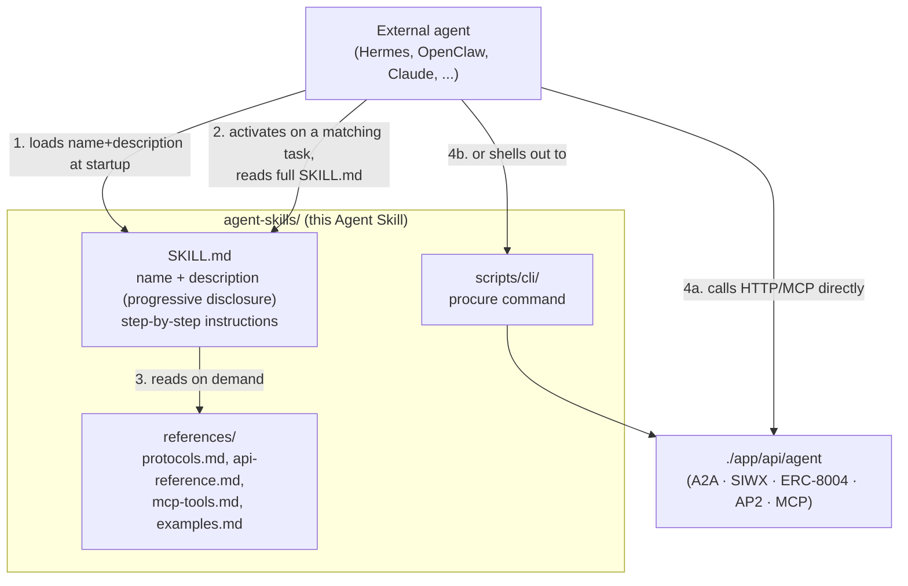
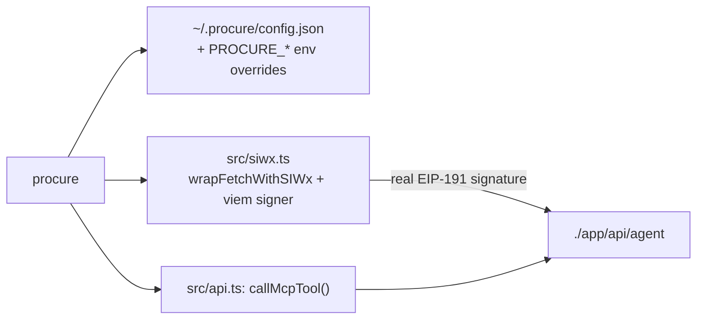

# `./agent-skills` — teaching an external agent to behave as the Enterprise

This is an [Agent Skills](https://agentskills.io/home)-format package: a
portable, version-controlled folder that tells any skills-compatible agent
(Claude, Hermes Agent, OpenClaw, or a custom framework) how to act as the
"Enterprise" in the procurement workflow — which endpoint to call for what,
in what order, and how to interpret the result — without that agent needing
to read this repo's source code.



## Why this structure

Per the [Agent Skills specification](https://agentskills.io/specification),
a skill loads progressively: an agent sees only `name` + `description` for
every installed skill at startup (cheap), reads the full `SKILL.md` body only
once a task matches (moderate), and loads `references/*` files only as
needed (expensive, on demand). This package follows that shape exactly:

| File/dir | Loaded when | Contents |
| --- | --- | --- |
| `SKILL.md` frontmatter (`name`, `description`) | Always, at agent startup | ~100 tokens: what this skill is for and when to use it. |
| `SKILL.md` body | Once a task matches | The 6-step procedure: discover -> authenticate -> discover providers -> check policy -> submit -> poll. |
| `references/protocols.md` | Implementing SIWX/A2A/ERC-8004/AP2 by hand | Wire formats, captured from this app's real responses. |
| `references/api-reference.md` | Calling the HTTP surface | Every entrypoint, request/response shapes. |
| `references/mcp-tools.md` | Using an MCP client | Tool list, schemas, the MCP trust-boundary note. |
| `references/examples.md` | Wanting a worked transcript | Real accepted/rejected/MCP-only runs. |
| `scripts/cli/` | Can shell out but not craft HTTP/MCP calls | The `procure` command (below). |

## The `procure` CLI

Modeled on [moltbook-cli](https://github.com/Moltbook-Official/moltbook-cli)
(the reference CLI for [Moltbook](https://github.com/Moltbook-Official/moltbook),
"the social network for AI agents"): a small dependency-light Node CLI, one
subcommand per capability, a `--json` flag on every command for
machine-readable output, and config resolved from a dotfile with env-var
overrides — same shape, applied to procurement instead of social posting.



### Install

Written in TypeScript, built with `tsc` to `dist/`.

```bash
cd agent-skills/scripts/cli
npm install      # runs `npm run build` via the `prepare` script
node dist/bin/procure.js status
# or, to use `procure` as a bare command:
npm link
```

### Commands

| Command | Description |
| --- | --- |
| `procure status` | Health-check the agent + show this CLI's resolved config. |
| `procure card [providerId]` | Fetch this agent's own Agent Card, or a provider's, by id. |
| `procure discover` | A2A discovery preview (no auth, no purchase). |
| `procure policy` | Show the enterprise's current KeeperHub policy. |
| `procure auth` | Sign a SIWX challenge and verify the round trip. |
| `procure submit --instruction <text> --amount <n> [--asset USDC] [--min-apy 4.0] [--protocol <name...>]` | Run the full procurement pipeline. |
| `procure task <taskId>` | Look up a previously submitted task. |
| `procure mcp-call <toolName> [jsonArgs]` | Call a tool on `./app/api/agent/mcp` directly. |
| `procure config get` / `procure config set <key> <value>` | Read/write `~/.procure/config.json`. |

Every command accepts `--json` for strict, single-line machine-readable
output (no summary line, no pretty-printing) — the same convention
`moltbook-cli` uses so an agent can parse output reliably.

### Environment variables

| Variable | Purpose | Default |
| --- | --- | --- |
| `PROCURE_BASE_URL` | Base URL of the running app | `http://localhost:3000` |
| `PROCURE_PRIVATE_KEY` | The calling agent's own signing key (EOA private key, `0x...`), used for real SIWX auth | unset -> a throwaway key is generated per invocation (a warning is printed) |
| `PROCURE_MCP_API_KEY` | Sent as `Authorization: Bearer <key>` to `/api/agent/mcp` if the server requires it | unset |
| `PROCURE_CHAIN_ID` | Bare chain id used to build the CAIP-2 id offered during SIWX | `84532` |

`~/.procure/config.json` (written by `procure config set`) holds the same
three keys (`baseUrl`, `privateKey`, `mcpApiKey`) and is overridden by the
environment variables above when both are present.

## SKILL.md at a glance

```yaml
name: agent-skills
description: >
  Teaches an external enterprise agent how to buy blockchain services
  through the Enterprise Procurement Agent at ./app/api/agent — SIWX,
  A2A/Agent Cards, ERC-8004, AP2, and KeeperHub-gated execution.
license: MIT
compatibility: Requires network access to a running instance of this app
  and, for the bundled CLI, Node.js 18+.
```

The `name` field matches this directory's name (`agent-skills`) per the
[specification's naming rule](https://agentskills.io/specification#name-field).
See [`SKILL.md`](SKILL.md) for the full body.

## Validating this skill

```bash
npx --yes skills-ref validate .
```

(the [`agentskills/agentskills`](https://github.com/agentskills/agentskills)
reference validator, published to npm as `skills-ref` — not bundled here to
keep this package dependency-free).

See [`../README.md`](../README.md) for the project-level overview and
[`../app/README.md`](../app/README.md) for what's actually behind these
endpoints.
