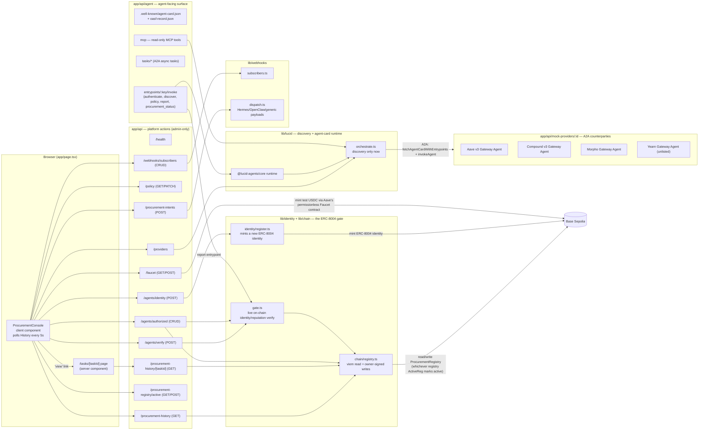
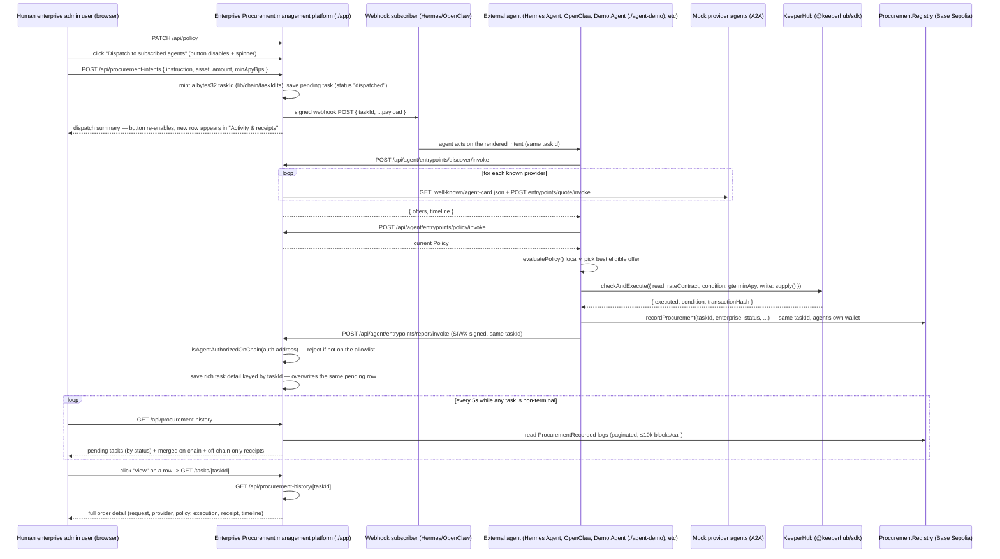

# Enterprise Procurement management platform (Web App)

A self-contained Next.js 16 App Router project — its own `package.json`,
`node_modules`, `next.config.mjs`, `tsconfig.json`, and env files all live
right here in `./app`, one level below the repo root. Its own nested `app/`
subfolder (i.e. `app/app/`) is the Next.js App Router directory proper
(`page.tsx`, `layout.tsx`, `api/`, `components/`); every path below is
written relative to *this* directory (`./app`), which is this project's root.

**This app is not the Procurement Agent's actor.** It's the enterprise's
oversight/management platform: a human admin sets policy and describes
procurement intents here, this app dispatches those intents as webhooks to
subscribed external agents, gates whatever those agents report back with a
live on-chain ERC-8004 check, and renders the resulting on-chain activity
history. The actual discovery -> policy evaluation -> KeeperHub execution
pipeline now runs on the external agent's own machine — see
[`../agent-skills/README.md`](../agent-skills/README.md), and
[`../agent-demo/README.md`](../agent-demo/README.md) for a runnable,
LLM-driven example of that external agent.

## Architecture



## Request lifecycle: one procurement intent, end to end



`GET /api/procurement-history` returns every task not yet in a terminal
status (`completed`/`rejected`/`failed`) as a pending row, labeled by
whichever status it last reported — `dispatched`, `authenticating`,
`discovering`, `evaluating_policy`, or `executing` (see
`ProcurementReportSchema`'s status enum in `lib/types.ts`) — alongside every
on-chain receipt. In practice today, `agent-skills/scripts/cli`'s
`orchestrate.ts` only calls `report` once, at the very end, with the final
status — so a pending row currently just reads "dispatched, awaiting agent"
for its whole time in flight, then resolves straight to a receipt row. The
finer statuses render correctly the moment an agent (this CLI or a real
Hermes Agent/OpenClaw integration) starts reporting progress mid-run
instead; no dashboard change would be needed.

Two things have to line up for that resolution to actually happen, both
fixed in this route and `lib/chain/taskId.ts`/`agent-skills/scripts/cli/src/orchestrate.ts`:

1. **The taskId has to round-trip.** `POST /api/procurement-intents` used
   to mint a UUID for its own bookkeeping; `procure act` always minted a
   *different*, unrelated bytes32 id for its on-chain receipt and report,
   because the platform's id wasn't in the bytes32 shape the contract needs.
   The dispatched row's status then never changed — the agent's completion
   report landed as a brand-new, uncorrelated task the dashboard had never
   seen, not as an update to the row it was already showing. Fixed by
   generating a bytes32 taskId up front (`lib/chain/taskId.ts`) and having
   `procure act` adopt it (from the webhook payload) instead of minting its
   own — see `agent-skills/README.md`'s note on this.
2. **A terminal task still needs to render even with no on-chain receipt.**
   The common case: the reporting agent has no `PROCURE_REGISTRY_ADDRESS`
   configured, so it logs "skipping on-chain receipt write" and reports
   anyway. A task in that state is terminal (excluded from "pending") but
   has no on-chain `ProcurementRecorded` log (excluded from "receipts" if
   that were sourced from the chain alone) — without the fallback below it
   would simply vanish from the table. `GET /api/procurement-history`
   handles this by shaping any terminal task with no matching on-chain
   receipt into the same row shape a real receipt uses (`offChainReceipt()`
   in that route), sourced entirely from the off-chain report — same
   Status/Details columns, just no `tx` link since none exists.

## Interaction Flow

| Step | Entrypoint / route | Auth / gate | Purpose |
| --- | --- | --- | --- |
| Discover this agent | `GET /api/agent/.well-known/agent-card.json` | none | A2A Agent Card, ERC-8004 trust metadata, AP2 role declaration. |
| Authenticate | `POST /api/agent/entrypoints/authenticate/invoke` | SIWX (401 + challenge, then signed retry) | Proves control of an address before `report`. |
| Discover providers | `POST /api/agent/entrypoints/discover/invoke` | none | A2A-discover and quote every known provider (`lib/lucid/mock-providers.ts`). Platform-hosted market data — unchanged from before. |
| Read policy | `POST /api/agent/entrypoints/policy/invoke` | none | The enterprise's current, admin-editable policy (`lib/keeperhub/policy.ts`). |
| **Report** | `POST /api/agent/entrypoints/report/invoke` | SIWX **+ on-chain ERC-8004 allowlist** (`isAgentAuthorizedOnChain`) | Replaces the old `procure` entrypoint. The external agent already discovered, evaluated, executed, and recorded on-chain itself — this just files the rich detail for the dashboard, and is rejected outright if the caller's address isn't on `ProcurementRegistry`'s allowlist. |
| Poll | `POST /api/agent/entrypoints/procurement_status/invoke` | none | Look up a previously reported `ProcurementTask` by id (`lib/store.ts`). |
| Set policy (admin) | `PATCH /api/policy` | admin-only, not agent-facing | The dashboard's editable policy form. |
| Describe intent (admin) | `POST /api/procurement-intents` | admin-only, not agent-facing | Records a pending intent and dispatches it as a webhook. **No execution happens here or anywhere in this app.** The dashboard's dispatch button disables and shows a spinner for the duration of this call. |
| View activity (admin) | `GET /api/procurement-history` | admin-only, not agent-facing | Every non-terminal task (by its last-reported status) plus every on-chain receipt — polled by the dashboard every 5s so "Activity & receipts" tracks progress without a reload. |
| View one order (admin) | `GET /api/procurement-history/[taskId]` | admin-only, not agent-facing | Backs `/tasks/[taskId]`, the "view" link on each "Activity & receipts" row — the same merge as above, narrowed to one task. |
| Register an ERC-8004 identity (admin) | `POST /api/agents/identity` | admin-only, not agent-facing | Mints a new ERC-8004 identity (`lib/identity/register.ts`), signed by `ENTERPRISE_ADMIN_PRIVATE_KEY`. Accepts an optional `agentWalletAddress`; when given, the minted identity is transferred to that address on-chain so it ends up owned by the agent wallet the admin names, not the signer. Only used when the admin hasn't connected a wallet via "Connect Wallet" — when one is connected, the panel signs and pays gas with it directly in the browser instead (`lib/identity/registerBrowser.ts`), and this route is bypassed entirely. A prerequisite for the row below — do this once per agent wallet first. |
| Authorize an agent (admin) | `POST /api/agents/verify` + connected-wallet `addAuthorizedAgent()` | admin-only, not agent-facing; requires a connected wallet | Runs the live ERC-8004 verify (`lib/identity/gate.ts`); on success, the connected wallet (the target registry's owner) signs `ProcurementRegistry.addAuthorizedAgent()` itself (`lib/chain/registryBrowser.ts`) — no server-signed fallback. `POST /api/agents/authorized/record` then records the effect for the dashboard's list. |
| Create a `ProcurementRegistry` (admin) | connected-wallet `ProcurementRegistryFactory.createNewProcurementRegistry()` | admin-only, not agent-facing; requires a connected wallet | The "New ProcurementRegistry contract creation" panel (`lib/chain/factoryBrowser.ts`) — the connected wallet deploys and becomes the owner of its own registry instance; there's no platform-held deploy key. |
| Track the active registry (admin) | `GET`/`POST /api/procurement-registry/active` | admin-only, not agent-facing | In-memory pointer (`lib/chain/activeRegistryStore.ts`) to whichever registry the connected wallet most recently resolved/created/picked — this is what `GET /api/procurement-history` reads from and what the inbound `report` entrypoint's allowlist gate checks against. Kept in sync automatically by the dashboard; no manual admin control. |
| Mint test USDC (admin) | `GET`/`POST /api/faucet` | admin-only, not agent-facing | The "Faucet" panel (`/faucet`, `lib/chain/faucet.ts` / `faucetBrowser.ts`) — mints Aave's Base Sepolia test USDC to any address via Aave's own permissionless `Faucet` contract, useful for funding KeeperHub's execution wallet ahead of a real `procure act`/`submit` run. Signed by `ENTERPRISE_ADMIN_PRIVATE_KEY`, or by the connected wallet if one is attached. |

Only `report` is gated by anything beyond a signature — and it's gated
twice: SIWX proves the caller controls the address, then the on-chain
`authorizedAgents` allowlist (populated only after a live ERC-8004 check)
proves the platform actually trusts that address to report at all.

## Module map

| Path | Responsibility |
| --- | --- |
| `app/page.tsx`, `app/components/*` | Dashboard UI: editable policy form, procurement-intent form (dispatch button disables + spinners while the `POST` is in flight), webhook subscriber CRUD, authorized-agent CRUD, the "Activity & receipts" table — one row per task, live-polled (`GET /api/procurement-history` every 5s) so its Status column tracks a subscribed agent from `dispatched` through the on-chain receipt without a manual reload — "Connect Wallet" (`app/components/ConnectWalletButton.tsx` — a picker between MetaMask and Rabby Wallet, backed by `lib/wallet/WalletProvider.tsx`). |
| `app/tasks/[taskId]/page.tsx` | The "Activity & receipts" table's per-row "view" link — a permalink with the full order detail (request, selected provider, policy evaluation, KeeperHub execution, on-chain receipt, timeline) for one task. Fetches `GET /api/procurement-history/[taskId]` rather than importing `lib/store.ts`/`lib/chain/registry.ts` directly (Next.js dev/Turbopack doesn't reliably share that module-level state between a Page's and a Route Handler's compiled module graph). |
| `app/api/agent/[...lucid]/route.ts` | Binds the real `@lucid-agents/http` route plan (`runtime.http.routes`) straight into Next.js — see `lib/lucid/http-bind.ts`. |
| `app/api/agent/mcp/route.ts` | MCP endpoint: `McpServer` + `WebStandardStreamableHTTPServerTransport`, stateless, read-only tools only. |
| `app/api/mock-providers/[providerId]/[...lucid]/route.ts` | Same binding pattern, for each mock provider's own tiny `@lucid-agents/core` runtime — unchanged; these are market data, not actor logic. |
| `app/api/policy`, `app/api/procurement-intents`, `app/api/procurement-history[/:taskId]`, `app/api/webhooks/subscribers[/:id]`, `app/api/agents/identity`, `app/api/agents/verify`, `app/api/agents/authorized[/:address]`, `app/api/procurement-registry/active`, `app/api/faucet` | The platform's own admin API — not part of the agent-facing contract (see `agent-skills/references/api-reference.md`). `/procurement-history` returns every non-terminal task (not just `status: "dispatched"`), and `/procurement-history/[taskId]` backs the task detail page above. `/agents/verify` runs the live ERC-8004 check ahead of a connected wallet's `addAuthorizedAgent()` call; `/procurement-registry/active` tracks which registry deployment the dashboard currently reads/gates against; `/faucet` backs the "Faucet" panel (see `lib/chain/faucet.ts` below). |
| `app/api/health`, `app/api/providers` | UI-only convenience routes. |
| `lib/types.ts` | Shared zod schemas + TS types: `ProcurementRequest`, `ProviderOffer`, `ProcurementTask`, `ProcurementReportSchema`, `Policy`. |
| `lib/lucid/agent.ts` | The remaining Lucid entrypoints: `authenticate`, `discover`, `policy`, `report` (SIWX + on-chain gate), `procurement_status`. |
| `lib/lucid/orchestrate.ts` | Discovery only now (`discoverOffers`) — the policy-evaluation/KeeperHub-execution half moved to `agent-skills/scripts/cli/src/orchestrate.ts`. |
| `lib/lucid/mock-providers.ts`, `lib/lucid/mock-provider-agent.ts` | Unchanged — seed data + tiny real `@lucid-agents/core` runtimes for the discoverable providers. |
| `lib/lucid/http-bind.ts` | The Next.js <-> `@lucid-agents/http` adapter — architecture-neutral, unchanged. |
| `lib/keeperhub/policy.ts` | The enterprise's policy — now mutable (`updatePolicy`), seeded from env, edited via `PATCH /api/policy`. `evaluatePolicy` is still exported for the `report` handler to audit against, mirrored in the CLI for the agent's own pre-execution check. |
| `lib/identity/gate.ts` | Live ERC-8004 verification of an inbound caller — composes `@lucid-agents/identity`'s `IdentityRegistryClient`/`ReputationRegistryClient`, since no ready-made "verify this caller" function exists in the SDK. |
| `lib/identity/register.ts` | Server-side fallback: mints a new ERC-8004 identity via `IdentityRegistryClient.register()`, signed by `ENTERPRISE_ADMIN_PRIVATE_KEY` — backs the "Authorize Agent (by Registering in the ERC-8004)" panel when no wallet is connected. When an `agentWalletAddress` is supplied, follows up with `IdentityRegistryClient.transfer()` to hand the freshly minted identity to that address, since `register()` itself always mints to whoever signs. |
| `lib/identity/registerCore.ts` | The mint+transfer logic itself (isomorphic — no server- or browser-only imports), shared by `register.ts` and `registerBrowser.ts` so the two signing paths can't drift. |
| `lib/identity/registerBrowser.ts` | Browser counterpart to `register.ts` — same mint+transfer flow, but signed by whatever wallet the admin connected via "Connect Wallet" (a viem `WalletClient` over `window.ethereum`), so that wallet pays its own gas instead of `ENTERPRISE_ADMIN_PRIVATE_KEY`. Never touches server-only env vars. |
| `lib/wallet/WalletProvider.tsx` | React context backing "Connect Wallet": discovers installed extensions via EIP-6963 (`eip6963:requestProvider`/`announceProvider`) and lets the admin explicitly pick **MetaMask** or **Rabby Wallet** rather than fighting over the ambiguous `window.ethereum` global (falls back to best-effort `isMetaMask`/`isRabby` flag sniffing for wallets that haven't adopted EIP-6963 yet). Tracks `accountsChanged`/`chainChanged` on whichever provider was picked, silently restores that choice on reload (remembered in `localStorage`, connection state itself is never persisted), and exposes a "switch to Base Sepolia" helper (`wallet_switchEthereumChain`/`wallet_addEthereumChain`). Wraps the whole page in `app/page.tsx`. |
| `lib/identity/authorizedAgentsStore.ts` | In-app display cache of which `agentId` an authorized address verified against, plus its reputation snapshot — the allowlist's source of truth is on-chain (`ProcurementRegistry.authorizedAgents`). |
| `lib/chain/registry.ts`, `lib/chain/registryBrowser.ts`, `lib/chain/procurementAbi.ts` | viem clients reading `ProcurementRecorded` logs and writing the on-chain allowlist — `registry.ts` for reads, `registryBrowser.ts` for the connected wallet's `addAuthorizedAgent()`/`revokeAuthorizedAgent()` writes (no server-signed path). `readProcurementHistory()` paginates `eth_getLogs` in ≤10,000-block chunks over the last `HISTORY_LOOKBACK_BLOCKS` — Base Sepolia's public RPC (`sepolia.base.org`) rejects a single `fromBlock: "earliest"` call outright past that range. |
| `lib/chain/activeRegistryStore.ts` | In-memory pointer to whichever `ProcurementRegistry` address is currently "active" — backs `GET`/`POST /api/procurement-registry/active`; see the note below the env var table. |
| `lib/chain/factoryAbi.ts`, `lib/chain/factoryBrowser.ts` | `ProcurementRegistryFactory`'s ABI and the connected-wallet `createNewProcurementRegistry()` call backing the "New ProcurementRegistry contract creation" panel, plus the read-only `getRegistriesByCreator()` lookup that pre-fills "Your registries." |
| `lib/chain/taskId.ts` | `randomTaskId()` — mints the bytes32 id `POST /api/procurement-intents` assigns a task, in the exact format `ProcurementRegistry.recordProcurement()` needs on-chain. `agent-skills/scripts/cli/src/orchestrate.ts`'s `procure act` reads this same id out of the webhook payload and reuses it, rather than minting its own — see the "Request lifecycle" section above for why that correlation matters. |
| `lib/chain/faucet.ts`, `lib/chain/faucetBrowser.ts`, `lib/chain/faucetAbi.ts` | Mints Aave's Base Sepolia test USDC to any address via Aave's own permissionless `Faucet` contract — `faucet.ts` signs with `ENTERPRISE_ADMIN_PRIVATE_KEY` server-side, `faucetBrowser.ts` signs with whichever wallet is connected. Backs `app/api/faucet` and the `/faucet` dashboard page (`app/components/FaucetPanel.tsx`). |
| `lib/webhooks/subscribers.ts`, `lib/webhooks/dispatch.ts` | Subscriber registry + per-platform (Hermes/OpenClaw/generic) payload building and HMAC/Bearer signing. |
| `lib/mcp/server.ts` | MCP tools — `get_agent_card`, `discover_providers`, `get_policy`, `get_procurement_status`. `submit_procurement` (execution) is retired. |
| `lib/store.ts` | Rich-detail rendering cache, keyed by `taskId` — no longer the source of truth for "did this happen" (that's on-chain now); still in-memory/process-local. |
| `lib/identity/registeredAgentsStore.ts` | Display-friendly log of identities minted via the "Authorize Agent (by Registering in the ERC-8004)" panel — the Identity Registry itself exposes no "list all agents" read, so this is process-local bookkeeping only; the identity's source of truth is the on-chain ERC-721 token. |

**Removed** in this migration (moved to `agent-skills/scripts/cli`, or retired outright since the "app simulates its own caller" pattern is exactly the actor behavior being removed): `lib/keeperhub/client.ts`, `lib/demo/enterprise-signer.ts`, `app/api/demo/authenticate`, `app/api/demo/procure`, `app/api/demo/tasks/[taskId]`.

## Running it

From inside this directory (`cd app` if you're at the repo root):

```bash
npm install
cp .env.example .env.local
npm run dev        # http://localhost:3000
npm run build      # production build
npm run typecheck  # tsc --noEmit
```

`package.json` pins an `overrides` entry redirecting `thirdweb` to
`vendor/thirdweb-stub` — see [`vendor/README.md`](vendor/README.md) for why
(short version: it's an unused peer dependency of `@lucid-agents/wallet`
that otherwise drags in a conflicting `viem`/`ox` tree via wagmi/WalletConnect
and breaks the type check).

## Environment variables

This app no longer holds a treasury signing key or a KeeperHub API key —
those moved to the external agent's own environment (see
[`../agent-skills/README.md#environment-variables`](../agent-skills/README.md#environment-variables)).
What's left here configures the platform itself: its own identity,
ERC-8004 gate, on-chain reads, and contract administration.

| Variable | Consumed by | Default | Notes |
| --- | --- | --- | --- |
| `APP_PUBLIC_ORIGIN` | this app | `http://localhost:3000` | Fallback origin used wherever a specific SIWX/payments origin isn't set. |
| `SIWX_PUBLIC_ORIGIN` | `@lucid-agents/payments` | `http://localhost:3000` | Must be the public HTTPS origin clients see in production; `http://localhost` is accepted only for local dev. |
| `PAYMENTS_RECEIVABLE_ADDRESS` | `@lucid-agents/payments` | `0x000...000` | `payTo` for the (unused in this demo) x402 payment rail; SIWX still requires *a* valid `PaymentsConfig`. |
| `PAYMENTS_NETWORK` | `@lucid-agents/payments` | `eip155:84532` (Base Sepolia) | CAIP-2 network id. |
| `PAYMENTS_FACILITATOR_URL` | `@lucid-agents/payments` | `https://x402.org/facilitator` | Never actually called — no priced entrypoints exist in this app. |
| `AGENT_DOMAIN` | `@lucid-agents/identity` | unset | Set with `RPC_URL` to enable live ERC-8004 resolution of this app's *own* agent card via `identityFromEnv()`. |
| `RPC_URL` | `@lucid-agents/identity`, `lib/identity/gate.ts`, `lib/chain/registry.ts` | `https://sepolia.base.org` | Now dual-purpose: this app's own identity resolution *and* the live inbound gate / on-chain reads. |
| `CHAIN_ID` | same as above | `84532` (Base Sepolia) | |
| `IDENTITY_AGENT_ID` | `@lucid-agents/identity` | `1` | Static self-registration id when no live registry is configured. |
| `REGISTER_IDENTITY` | `@lucid-agents/identity` | `false` | Only relevant in live mode; requires a signing wallet. |
| `IDENTITY_REGISTRY_ADDRESS`, `REPUTATION_REGISTRY_ADDRESS` | `lib/identity/gate.ts`, `lib/identity/register.ts` | unset -> resolved via `@lucid-agents/identity`'s `getRegistryAddress()` | Override only if targeting a non-default deployment. |
| `ENTERPRISE_ADMIN_PRIVATE_KEY` | `lib/identity/register.ts` (`POST /api/agents/identity`) | unset -> registration disabled (`503`) *unless a wallet is connected via "Connect Wallet"* | Signs the ERC-8004 mint — `register()` mints to whoever signs. The admin panel's **Agent Wallet Address** field then transfers the minted identity to the agent wallet the admin actually wants registered, so this key no longer needs to be the agent's own (e.g. `PROCURE_PRIVATE_KEY`); it only needs gas on Base Sepolia. Renamed from `AGENT_IDENTITY_PRIVATE_KEY`, which implied it had to be a specific agent's key. Only used as a fallback — see the row below. Unrelated to `ProcurementRegistry` administration, which has no platform key at all (see the note below the table). |
| `NEXT_PUBLIC_CHAIN_ID`, `NEXT_PUBLIC_IDENTITY_REGISTRY_ADDRESS` | `lib/identity/registerBrowser.ts` (client-side, via "Connect Wallet") | unset -> Base Sepolia + `@lucid-agents/identity`'s default registry address | Client-side mirrors of `CHAIN_ID`/`IDENTITY_REGISTRY_ADDRESS`, only needed to target a non-default deployment. Next.js inlines `NEXT_PUBLIC_*` vars into the browser bundle at build time — never put a secret in one. |
| `AGENT_MCP_API_KEY` | `app/api/agent/mcp` | unset | If set, MCP requests must send `Authorization: Bearer <key>`. |
| `NEXT_PUBLIC_PROCUREMENT_REGISTRY_FACTORY_ADDRESS` | `lib/chain/factoryBrowser.ts` (client-side, via "Connect Wallet") | unset -> the "New ProcurementRegistry contract creation" panel is disabled | The deployed `ProcurementRegistryFactory` address (see `../contracts/README.md`). Always signed by the connected wallet — no server-side fallback, since `createNewProcurementRegistry()` makes the signer the new registry's owner. Also used read-only (no signature needed) to populate the "Authorized agents" panel's **Target ProcurementRegistry** field straight from the factory's own `getRegistriesByCreator(connectedWallet)` storage — see the note below the table. |
| `FAUCET_CONTRACT_ADDRESS`, `FAUCET_USDC_ADDRESS` | `lib/chain/faucet.ts` (server-signed "Faucet" panel) | Aave's real Base Sepolia `Faucet`/test-USDC addresses (see `agent-demo/README.md#base-sepolia-token-addresses--faucets`) | Only override if Aave's Base Sepolia deployment changes. |
| `NEXT_PUBLIC_FAUCET_CONTRACT_ADDRESS`, `NEXT_PUBLIC_FAUCET_USDC_ADDRESS` | `lib/chain/faucetBrowser.ts` (connected-wallet "Faucet" panel) | same as above | Client-side mirrors, inlined into the browser bundle at build time. |
| `POLICY_MAX_USD_PER_TASK` | `lib/keeperhub/policy.ts` | `1000000` | Seed default only — overwritten in-process by `PATCH /api/policy`. |
| `POLICY_MIN_APY_BPS` | `lib/keeperhub/policy.ts` | `400` (4.00%) | Same. |
| `POLICY_ALLOWED_ASSETS` | `lib/keeperhub/policy.ts` | `USDC` | Comma-separated seed default. |
| `POLICY_ALLOWED_PROTOCOLS` | `lib/keeperhub/policy.ts` | `aave-v3,compound-v3,morpho` | Comma-separated seed default; excludes the `yearn` mock provider on purpose (see `agent-skills/references/examples.md`). |

See [`../README.md`](../README.md) for the project-level overview,
[`../contracts/README.md`](../contracts/README.md) for `ProcurementRegistry`'s
own env vars, and [`../agent-skills/README.md`](../agent-skills/README.md)
for the CLI's (the actor's) own variables.

> **`ProcurementRegistry` has no platform-held address or key anymore —
> `.env.local` doesn't configure either one.** A registry's `Ownable` owner
> is always the wallet that called `ProcurementRegistryFactory.
> createNewProcurementRegistry()`, so:
> - **Address**: the "Authorized agents" panel's **Target ProcurementRegistry**
>   field is always sourced live from
>   `ProcurementRegistryFactory.getRegistriesByCreator(connectedWallet)`
>   (`refreshOwnedRegistries()` in `app/components/ProcurementConsole.tsx`),
>   pre-filled with the most recently created registry and overridable via
>   the "Your registries" pills. There used to be a
>   `NEXT_PUBLIC_PROCUREMENT_REGISTRY_ADDRESS`/`PROCUREMENT_REGISTRY_ADDRESS`
>   env-var default; both were removed because a hardcoded address could
>   silently drift from the registry a connected wallet actually owns on the
>   factory, which let an agent get authorized on one registry while
>   `agent-demo`/`agent-skills` (via `PROCURE_REGISTRY_ADDRESS`) wrote
>   receipts against a different, stale one — reverting with
>   `NotAuthorizedAgent`.
> - **Owner key**: `addAuthorizedAgent()`/`revokeAuthorizedAgent()` are only
>   ever signed by that same connected wallet (`lib/chain/registryBrowser.ts`)
>   — there used to be a `CONTRACT_OWNER_PRIVATE_KEY` server-signed fallback
>   for when no wallet was connected; it was removed because it pointed at a
>   fixed registry deployed outside the factory, so it could never actually
>   be that registry's owner once every registry started being created (and
>   owned) through the factory instead. The "Authorized agents" panel now
>   requires a connected wallet, full stop.
>
> Reads that have no browser wallet to ask — on-chain history
> (`GET /api/procurement-history`) and the inbound `report` entrypoint's
> allowlist gate (`lib/lucid/agent.ts`) — use whichever registry the
> dashboard most recently told the server is "active"
> (`lib/chain/activeRegistryStore.ts`, process-local/in-memory, resets on
> restart), kept in sync automatically by `POST /api/procurement-registry/active`
> every time the connected wallet resolves, creates, or picks a registry.

### Server secrets vs. caller secrets

The variables above are this app's own — fixed server-side, read once from
`process.env` on this deployment (or `.env.local`, never the committed
`.env.example`). An external agent calling `app/api/agent` over HTTP or MCP
cannot read, set, or override any of them; it authenticates *to* this app
using credentials it holds itself, from its own environment — see
[`agent-skills/README.md`](../agent-skills/README.md#environment-variables)
for the `PROCURE_*` side of this table:

| Server-side (this table) | Caller-side (`agent-skills` CLI / any external agent) |
| --- | --- |
| *(none — `ProcurementRegistry` administration has no platform key; see the note above)* | `PROCURE_PRIVATE_KEY` — the **agent's own** wallet: signs SIWX challenges *and* writes the on-chain receipt (`ProcurementRegistry.recordProcurement`). |
| `ENTERPRISE_ADMIN_PRIVATE_KEY` — the dashboard's "Authorize Agent" panel's fallback minting key, used to sign the one-time ERC-8004 registration when no wallet is connected. Since `register()` always mints to whoever signs, and the panel's **Agent Wallet Address** field then transfers the identity on-chain to whichever address the admin names, this key no longer has to belong to the agent — it just needs gas. Superseded per-registration by "Connect Wallet": if the admin connects their own browser wallet, it signs and pays instead, and this key is never touched. | The admin supplies the target **Agent Wallet Address** in the panel (often the same address as `PROCURE_PRIVATE_KEY`'s, but no private key for it is ever given to this app — not even when the admin connects a wallet, since that wallet only signs its own transactions in the browser). |
| `AGENT_MCP_API_KEY` — the shared secret `app/api/agent/mcp` checks *incoming* requests against. | `PROCURE_MCP_API_KEY` — the same value, held by the caller and sent as `Authorization: Bearer <key>`. |
| `RPC_URL` — read-only chain queries, against whichever registry `lib/chain/activeRegistryStore.ts` currently holds (see the note above; not an env var). | `PROCURE_KEEPERHUB_API_KEY` / `PROCURE_KEEPERHUB_BASE_URL` / `PROCURE_KEEPERHUB_EXECUTION_MODE` — the agent's own KeeperHub org credentials, used to actually execute. **This app never holds these anymore.** |

The only value a caller needs to *match* (not replace) is
`AGENT_MCP_API_KEY`/`PROCURE_MCP_API_KEY`, for MCP auth. SIWX authentication
is a signature check against the caller's own wallet; the `report`
entrypoint's on-chain allowlist check is a separate, additional gate that no
signature alone satisfies — the address must have been explicitly
authorized first, by the registry-owning wallet connected in the "Authorized
agents" panel (`POST /api/agents/verify` + `addAuthorizedAgent()` via
`lib/chain/registryBrowser.ts`).

## DEMO Video

- Demonstrate the interaction between the Demo Agent (`./agent-demo`) and Web App (`./app`):    
  https://youtu.be/ZZuMhfOZRqs?si=etQZqzL-GYKBkl2P