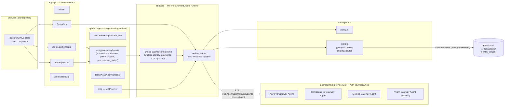
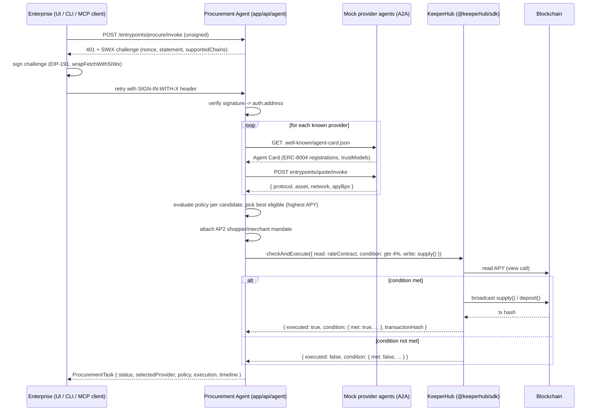

# `./app` — UI + API

A self-contained Next.js 16 App Router project — its own `package.json`,
`node_modules`, `next.config.mjs`, `tsconfig.json`, and env files all live
right here in `./app`, one level below the repo root. Its own nested `app/`
subfolder (i.e. `app/app/`) is the Next.js App Router directory proper
(`page.tsx`, `layout.tsx`, `api/`, `components/`); every path below is
written relative to *this* directory (`./app`), which is this project's root.

## Architecture



## Request lifecycle: one `procure` call



## Interaction model

The sequence diagram above zooms into step 5 below. Zoomed out, every caller
of `app/api/agent` — UI, `procure` CLI, or an external agent like Hermes —
drives the same sequence, documented for agent consumption in
[`agent-skills/SKILL.md`](../agent-skills/SKILL.md):

| Step | Entrypoint | Auth required | Purpose |
| --- | --- | --- | --- |
| 1. Discover | `GET /api/agent/.well-known/agent-card.json` | none | Read this agent's A2A Agent Card, ERC-8004 trust metadata, AP2 role declaration. |
| 2. Authenticate | `POST /api/agent/entrypoints/authenticate/invoke` | SIWX (401 + challenge, then signed retry) | Prove control of the Enterprise's wallet. No payment, no side effects. |
| 3. Discover providers | `POST /api/agent/entrypoints/discover/invoke` | none | A2A-discover and quote every known provider (`lib/lucid/mock-providers.ts`). No purchase, no KeeperHub call. |
| 4. Check policy | `POST /api/agent/entrypoints/policy/invoke` | none | Read the KeeperHub-enforced policy (`lib/keeperhub/policy.ts`) before committing. |
| 5. Procure | `POST /api/agent/entrypoints/procure/invoke` | SIWX (its own challenge/retry — step 2 need not be called first) | The full pipeline shown in the sequence diagram above. |
| 6. Poll | `POST /api/agent/entrypoints/procurement_status/invoke` | none | Look up a previously submitted `ProcurementTask` by id (`lib/store.ts`). |

Steps 1, 3, 4, and 6 are read-only previews; only steps 2 and 5 require the
caller to sign anything. `discover` (step 3) decides *who to buy from* over
A2A; KeeperHub, invoked internally inside step 5 via
`lib/keeperhub/client.ts`, decides *how to execute* — no caller talks to
KeeperHub directly, agent or otherwise.

## Module map

| Path | Responsibility |
| --- | --- |
| `app/page.tsx`, `app/components/*` | Dashboard UI: wallet auth, request form, provider list, policy panel, timeline. |
| `app/api/agent/[...lucid]/route.ts` | Binds the real `@lucid-agents/http` route plan (`runtime.http.routes`) straight into Next.js — see `lib/lucid/http-bind.ts`. |
| `app/api/agent/mcp/route.ts` | MCP endpoint: `McpServer` + `WebStandardStreamableHTTPServerTransport`, stateless. |
| `app/api/mock-providers/[providerId]/[...lucid]/route.ts` | Same binding pattern, for each mock provider's own tiny `@lucid-agents/core` runtime. |
| `app/api/health`, `app/api/providers`, `app/api/demo/*` | UI-only convenience routes — not the agent-facing contract (see `agent-skills/references/api-reference.md`). |
| `lib/types.ts` | Shared zod schemas + TS types: `ProcurementRequest`, `ProviderOffer`, `ProcurementTask`, `Policy`. |
| `lib/lucid/agent.ts` | Builds the Procurement Agent's `@lucid-agents/core` runtime and its five entrypoints. |
| `lib/lucid/orchestrate.ts` | The actual pipeline: discovery -> policy -> selection -> KeeperHub execution. Called identically by the HTTP entrypoint, the MCP tool, and the UI. |
| `lib/lucid/mock-providers.ts`, `lib/lucid/mock-provider-agent.ts` | Seed data + tiny real `@lucid-agents/core` runtimes for the three (four, counting the policy-rejected one) discoverable providers. |
| `lib/lucid/http-bind.ts` | The Next.js <-> `@lucid-agents/http` adapter (no framework package needed — both speak Web `Request`/`Response`). |
| `lib/keeperhub/policy.ts` | The enterprise's execution policy + evaluator. |
| `lib/keeperhub/client.ts` | `@keeperhub/sdk` `DirectExecutor.checkAndExecute()` wrapper, with a same-shaped `DEMO_MODE` simulator. |
| `lib/mcp/server.ts` | MCP tool definitions, thin wrappers over `lib/lucid` + `lib/keeperhub`. |
| `lib/demo/enterprise-signer.ts` | Demo-only stand-in for the enterprise's real wallet — real EIP-191 signing via `viem`, real SIWX verification. |
| `lib/store.ts` | Process-local task store. |

## Running it

From inside this directory (`cd app` if you're at the repo root):

```bash
npm install
cp .env.example .env.local
npm run dev        # http://localhost:3000
npm run build      # production build
npm run typecheck  # tsc --noEmit
```

`package.json` pins an `overrides` entry redirecting `thirdweb` to
`vendor/thirdweb-stub` — see [`vendor/README.md`](vendor/README.md) for why
(short version: it's an unused peer dependency of `@lucid-agents/wallet`
that otherwise drags in a conflicting `viem`/`ox` tree via wagmi/WalletConnect
and breaks the type check).

## Environment variables

Every variable below has a `DEMO_MODE`-safe default — nothing here is
required to run the app locally.

| Variable | Consumed by | Default | Notes |
| --- | --- | --- | --- |
| `APP_PUBLIC_ORIGIN` | this app | `http://localhost:3000` | Fallback origin used wherever a specific SIWX/payments origin isn't set. |
| `DEMO_MODE` | `lib/keeperhub/client.ts` | `true` | Set `false` (with `KEEPERHUB_API_KEY` set) to force real KeeperHub calls. |
| `SIWX_PUBLIC_ORIGIN` | `@lucid-agents/payments` | `http://localhost:3000` | Must be the public HTTPS origin clients see in production; `http://localhost` is accepted only for local dev. |
| `PAYMENTS_RECEIVABLE_ADDRESS` | `@lucid-agents/payments` | `0x000...000` | `payTo` for the (unused in this demo) x402 payment rail; SIWX still requires *a* valid `PaymentsConfig`. |
| `PAYMENTS_NETWORK` | `@lucid-agents/payments` | `eip155:84532` (Base Sepolia) | CAIP-2 network id. |
| `PAYMENTS_FACILITATOR_URL` | `@lucid-agents/payments` | `https://x402.org/facilitator` | Never actually called — no priced entrypoints exist in this app. |
| `AGENT_DOMAIN` | `@lucid-agents/identity` | unset | Set with `RPC_URL` to enable live ERC-8004 resolution via `identityFromEnv()`. |
| `RPC_URL` | `@lucid-agents/identity` | unset | EVM RPC endpoint for on-chain identity verification. |
| `CHAIN_ID` | `@lucid-agents/identity` | `84532` | Also used by the demo signer to pick a `supportedChains` entry. |
| `IDENTITY_AGENT_ID` | `@lucid-agents/identity` | `1` | Static self-registration id when no live registry is configured. |
| `REGISTER_IDENTITY` | `@lucid-agents/identity` | `false` | Only relevant in live mode; requires a signing wallet. |
| `DEVELOPER_WALLET_PRIVATE_KEY`, `AGENT_WALLET_PRIVATE_KEY` | `@lucid-agents/wallet` | unset | Only needed for live identity registration or outbound x402 payments — unused by this demo's read paths. |
| `AGENT_MCP_API_KEY` | `app/api/agent/mcp` | unset | If set, MCP requests must send `Authorization: Bearer <key>`. |
| `KEEPERHUB_API_KEY` | `@keeperhub/sdk` | unset | Organization key (`kh_...`). Unset -> simulated execution. |
| `KEEPERHUB_BASE_URL` | `@keeperhub/sdk` | `https://app.keeperhub.com` | |
| `KEEPERHUB_EXECUTION_MODE` | (reserved) | `direct` | `direct` uses `DirectExecutor`; a `workflow` mode (KeeperHub visual workflows) is a natural extension point, not wired up in this demo. |
| `POLICY_MAX_USD_PER_TASK` | `lib/keeperhub/policy.ts` | `1000000` | |
| `POLICY_MIN_APY_BPS` | `lib/keeperhub/policy.ts` | `400` (4.00%) | |
| `POLICY_ALLOWED_ASSETS` | `lib/keeperhub/policy.ts` | `USDC` | Comma-separated. |
| `POLICY_ALLOWED_PROTOCOLS` | `lib/keeperhub/policy.ts` | `aave-v3,compound-v3,morpho` | Comma-separated; excludes the `yearn` mock provider on purpose (see `agent-skills/references/examples.md`). |
| `ENTERPRISE_DEMO_PRIVATE_KEY` | `lib/demo/enterprise-signer.ts` | unset (generates an ephemeral key) | The demo's stand-in enterprise wallet. Replace this module with real wallet integration for production use. |

See [`../README.md`](../README.md) for the project-level overview and
[`../agent-skills/README.md`](../agent-skills/README.md) for the CLI's own
variables.

### Server secrets vs. caller secrets

The variables above are this app's own — fixed server-side, read once from
`process.env` on this deployment (or `.env.local`, never the committed
`.env.example`). An external agent calling `app/api/agent` over HTTP or MCP
cannot read, set, or override any of them; it authenticates *to* this app
using credentials it holds itself, from its own environment — see
[`agent-skills/README.md`](../agent-skills/README.md#environment-variables)
for the `PROCURE_*` side of this table:

| Server-side (this table) | Caller-side (`agent-skills` CLI / any external agent) |
| --- | --- |
| `DEVELOPER_WALLET_PRIVATE_KEY`, `AGENT_WALLET_PRIVATE_KEY` — the **Procurement Agent's own** operator/signing wallets, read server-side by `@lucid-agents/wallet`. | `PROCURE_PRIVATE_KEY` — the **Enterprise's** wallet the calling agent signs SIWX challenges with (steps 2/5 above). |
| `AGENT_MCP_API_KEY` — the shared secret `app/api/agent/mcp` checks *incoming* requests against. | `PROCURE_MCP_API_KEY` — the same value, held by the caller and sent as `Authorization: Bearer <key>`. |
| `KEEPERHUB_API_KEY` / `KEEPERHUB_BASE_URL` / `KEEPERHUB_EXECUTION_MODE` — this app's own KeeperHub account, used internally inside step 5 (`procure`). | *(none — the calling agent never talks to KeeperHub directly; it only sees the resulting `ProcurementTask`.)* |

The only value a caller needs to *match* (not replace) is
`AGENT_MCP_API_KEY`/`PROCURE_MCP_API_KEY`, for MCP auth; SIWX authentication
is a signature check against the caller's own wallet, never against a
server-held private key.
