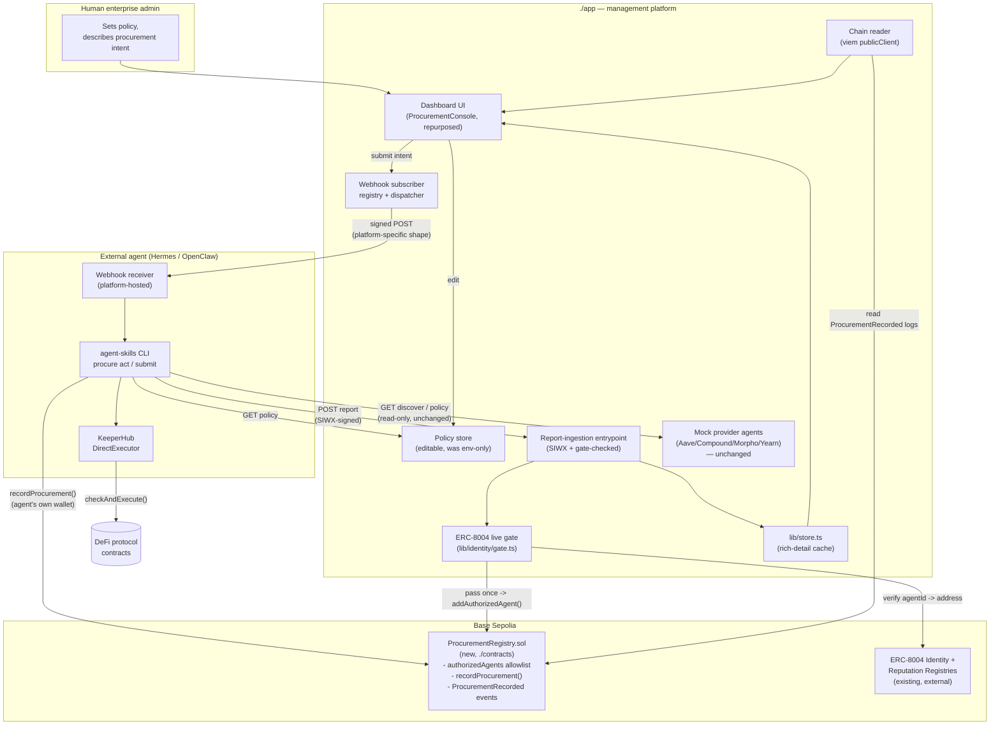
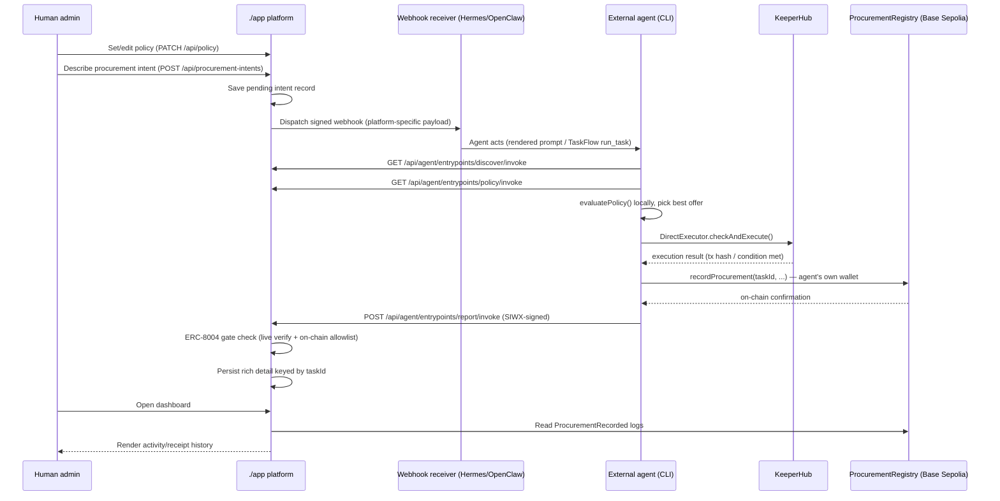

# Architecture migration: `./app` becomes a management platform; the external agent (via `./agent-skills`) becomes the actor

## Context

Today `./app` (the Next.js server) plays two roles at once: it's both the **Procurement Agent itself** (runs A2A discovery, evaluates the enterprise's spending policy, and calls KeeperHub's `DirectExecutor.checkAndExecute()` server-side inside `POST /api/agent/entrypoints/procure/invoke`) and the **dashboard the enterprise admin looks at**. `./agent-skills` is currently just a thin HTTP/MCP client (`procure` CLI) that tells an external agent (Hermes, OpenClaw) how to call into that server-side pipeline — it holds no KeeperHub credentials, no wallet key, no decision logic of its own.

The user wants to invert this: **`./app` stops being the actor.** It becomes a governance/oversight platform that (a) lets a human enterprise admin set policy and describe a procurement intent through the existing UI, (b) pushes that intent out as a **webhook** to whichever external agent (Hermes Agent / OpenClaw) is subscribed, (c) gates any agent that writes results back using a **live, on-chain ERC-8004 identity check** (not just a SIWX signature), and (d) renders an activity/receipt dashboard sourced from **on-chain history** in a new `./contracts` project on Base Sepolia. The external agent — running the `agent-skills` CLI toolkit on its own infrastructure, with its own KeeperHub API key and its own wallet — becomes the one that actually discovers providers' rates, evaluates policy, executes via KeeperHub, and writes the receipt on-chain.

This researched-and-confirmed baseline (from exploration earlier in this session) informs every phase below:

| Finding | Implication |
|---|---|
| No session/JWT exists after SIWX today — every call re-verifies a fresh signature | "Signed-in agent" tracking for the dashboard has to be built, not reused |
| `@lucid-agents/identity` exports raw registry-client primitives (`createIdentityRegistryClient(...).get/getAgentWallet/isAuthorizedOrOwner`, `createReputationRegistryClient(...).getSummary`) but no ready-made "verify this caller" function | A gate function has to be composed from these primitives (Phase 3) |
| `app/lib/store.ts` is an in-memory `Map`, already flagged in its own comment as needing durable storage | The on-chain registry becomes that durable store |
| Mock provider agents (`lib/lucid/mock-providers.ts`, `mock-provider-agent.ts`) and the generic `http-bind.ts` route binder are **not** actor logic | They represent third-party counterparties/plumbing and stay server-side unchanged |

**User-confirmed scope decisions** (from `AskUserQuestion`):

| # | Decision |
|---|---|
| 1 | **Live on-chain ERC-8004 verification**, not a static allowlist alone |
| 2 | **On-chain persistence** for dashboard history — new `./contracts` directory, deployed to Base Sepolia |
| 3 | **Keep the current dashboard UI** (policy input, procurement-request form, discovery view) as the human admin's console — submitting no longer executes anything itself; it **dispatches a webhook** to a subscribed external agent (Hermes Agent and/or OpenClaw), which then acts on its own initiative via the `agent-skills` CLI |

Fetched webhook contracts — both platforms are **inbound webhook receivers**, not senders, so our app must format outbound POSTs to match each, and neither lets us register a route remotely (that happens on the agent operator's own side):

| Platform | Inbound URL | Auth | Body constraint | Route registration |
|---|---|---|---|---|
| **Hermes Agent** | `POST http://<host>:8644/webhooks/<route-name>` | Provider-specific headers, or generic `X-Webhook-Signature-V2` + `X-Webhook-Timestamp` HMAC pair | Arbitrary JSON — rendered into the operator's own prompt template via dot-notation (`{instruction}`, `{asset}`, ...) | Done on the Hermes operator's own instance: `hermes webhook subscribe ...` or `~/.hermes/config.yaml` |
| **OpenClaw** | `POST /plugins/webhooks/<routeId>` | `Authorization: Bearer <secret>` or `x-openclaw-webhook-secret: <secret>` | Must be one of OpenClaw's **TaskFlow action schemas verbatim** (e.g. `{"action":"create_flow","goal":"...","status":"queued","notifyPolicy":"done_only"}`) — unknown fields rejected | Done on the OpenClaw operator's own side |
| **Generic** (fallback / our own CLI) | Admin-supplied URL | `X-Procurement-Signature-256: sha256=<hmac>` (GitHub-style) | Our own documented schema — full `ProcurementRequest` + `Policy` + `taskId` | N/A — always works, no platform-specific registration needed |

The dashboard's job is to let the admin **enter** a subscriber's `{name, platform, url, secret}` (provisioned by that agent's own operator) and dispatch a correctly-shaped, correctly-signed payload to it.

---

## Target architecture (component diagram)

## End-to-end flow (sequence diagram)

Mock provider agents (Aave/Compound/Morpho/Yearn) keep living in `./app` unchanged — they're the market, not the actor.

---

## Phase 1 — `./contracts`: on-chain history + on-chain agent allowlist (Foundry, Base Sepolia)

New standalone Foundry project (matches the repo's existing viem/EVM tooling; no Node build step needed for Solidity).

| File | Purpose |
|---|---|
| `contracts/foundry.toml`, `contracts/remappings.txt` | Foundry project config; OpenZeppelin `Ownable` via `forge install OpenZeppelin/openzeppelin-contracts` |
| `contracts/src/ProcurementRegistry.sol` | `Ownable`. `mapping(address => bool) authorizedAgents` + `addAuthorizedAgent`/`revokeAuthorizedAgent` (`onlyOwner`) — populated only after `./app`'s live ERC-8004 verification passes, so the contract itself stays simple rather than hard-coding the deployed ERC-8004 ABI. `recordProcurement(taskId, enterprise, status, asset, amount, apyBps, detailsHash, detailsURI)` — `require(authorizedAgents[msg.sender])`, rejects duplicate `taskId`, stores a compact `Receipt`, appends to an enumerable `taskIds[]`, emits `ProcurementRecorded(...)` with everything needed to render the dashboard from logs alone. View helpers: `getTaskCount()`, `getTaskIdAt(uint256)`, `receipts(bytes32)` |
| `contracts/script/DeployProcurementRegistry.s.sol` | `forge script` deploy, reads `DEPLOYER_PRIVATE_KEY`/`BASE_SEPOLIA_RPC_URL` from env |
| `contracts/test/ProcurementRegistry.t.sol` | Foundry tests: only-authorized-agent-can-record, duplicate-taskId reverts, owner-only allowlist management, event fields match input |
| `contracts/.env.example`, `contracts/README.md` | Build/test/deploy commands, Base Sepolia explorer link placeholder |

**I will write and test all of this locally (`forge build`, `forge test`), but will not broadcast the actual Base Sepolia deployment without your go-ahead and a funded deployer key** — that's a real, hard-to-reverse on-chain action outside this planning step. Once deployed, the resulting address feeds Phases 2–4.

---

## Phase 2 — `./agent-skills/scripts/cli`: the actor moves here

| File | Change | Purpose |
|---|---|---|
| `src/keeperhub.ts` | New | Port of `app/lib/keeperhub/client.ts`'s `checkApyAndExecuteSupply`/`isKeeperHubDemoMode`, driven by CLI config instead of `process.env` directly |
| `src/policy.ts` | New | Port of the pure `evaluatePolicy` function from `app/lib/keeperhub/policy.ts` (small, duplicated — no workspace linkage between the two projects) |
| `src/registry.ts` | New | viem wallet client (reuses the account already built in `src/siwx.ts`) that calls `ProcurementRegistry.recordProcurement(...)` on Base Sepolia after execution |
| `src/procurementAbi.ts` | New | Hand-authored ABI fragment for the functions/events the CLI needs, mirrors `contracts/src/ProcurementRegistry.sol` |
| `src/config.ts` | Modify | Add `keeperHubApiKey`, `keeperHubBaseUrl`, `keeperHubExecutionMode`, `registryAddress`, `rpcUrl` fields, resolved the existing way (`~/.procure/config.json` + `PROCURE_*` env override) |
| `package.json` | Modify | Add `@keeperhub/sdk` (pin to match `app/package.json`'s `^0.1.1`) |
| `bin/procure.ts` | Modify | Rework `submit`: fetch `discover`+`policy` from the server (unchanged reads), run `evaluatePolicy` locally, call `checkApyAndExecuteSupply` locally with the CLI's own KeeperHub key, write the receipt via `registry.ts`, then POST the full result to the server's report-ingestion entrypoint (Phase 4). Add `procure act [--payload <file\|->]` — accepts the exact JSON shape the webhook dispatcher sends, so a Hermes prompt-triggered shell tool or an OpenClaw `run_task` action can pipe a received webhook straight into it |

New CLI env vars (all `PROCURE_*`, same resolution pattern as today):

| Variable | Purpose |
|---|---|
| `PROCURE_KEEPERHUB_API_KEY` | The external agent's own KeeperHub org key |
| `PROCURE_KEEPERHUB_BASE_URL` | KeeperHub API base URL |
| `PROCURE_KEEPERHUB_EXECUTION_MODE` | `direct` (matches server's current default) |
| `PROCURE_REGISTRY_ADDRESS` | Deployed `ProcurementRegistry` address (Phase 1 output) |
| `PROCURE_RPC_URL` | Base Sepolia RPC endpoint |
| `PROCURE_PRIVATE_KEY` *(existing)* | Reused as both the SIWX signer **and** the on-chain treasury/registry-write key — `siwx.ts`'s own doc comment already anticipates this dual use |

**Why discovery/policy stay server-fetched rather than fully reimplemented in the CLI:** the mock provider agents are platform-hosted market data (not the enterprise's own logic), and policy is admin-governed config the dashboard now lets a human edit live — both are naturally something the CLI *reads*, while KeeperHub execution and the actual buy/no-buy decision are what the user specifically called out as actor logic to relocate.

---

## Phase 3 — `./app`: live ERC-8004 gate

| File | Change | Purpose |
|---|---|---|
| `app/lib/identity/gate.ts` | New | `verifyAgentOnChain(agentId, expectedAddress)` — uses `createIdentityRegistryClient({chainId, rpcUrl})` (Base Sepolia via `RPC_URL`/`CHAIN_ID`, canonical address via `getRegistryAddress('identity', chainId)`) to call `.get(agentId)`/`.getAgentWallet(agentId)` and confirm it resolves to the caller's SIWX-authenticated address, plus `createReputationRegistryClient(...).getSummary(agentId)` for a trust score shown on the dashboard. Composes the raw SDK primitives found in exploration — no ready-made "verify" call exists |
| `app/app/api/agents/authorized/route.ts` | New | Admin-only, plain Next.js route (a platform action, not an agent-facing Lucid entrypoint). `POST {address, agentId}` runs `verifyAgentOnChain`, and on success calls `ProcurementRegistry.addAuthorizedAgent(address)` using a new **platform-owned** signer (`CONTRACT_OWNER_PRIVATE_KEY` — legitimately platform-scoped since it administers contract ownership, not enterprise treasury funds). `DELETE` revokes both the in-app record and calls `revokeAuthorizedAgent` |
| `app/lib/store.ts` | Modify (role change) | Stays as the rich-detail rendering cache (full `ProcurementTask`/timeline), but is no longer the source of truth for "did this happen" — that's the chain now |

---

## Phase 4 — `./app`: webhook dispatch + report ingestion + chain-backed dashboard

| File | Change | Purpose |
|---|---|---|
| `app/lib/webhooks/subscribers.ts` | New | Subscriber CRUD (in-memory, same posture as today's store): `{id, name, platform: 'hermes'\|'openclaw'\|'generic', url, secret, active}` |
| `app/lib/webhooks/dispatch.ts` | New | `dispatchProcurementIntent(event)` — one payload builder per platform, per the table in Context above (Hermes flat JSON + `X-Webhook-Signature-V2`; OpenClaw TaskFlow action schema + Bearer; generic documented schema + `X-Procurement-Signature-256`) |
| `app/app/api/webhooks/subscribers/route.ts` (+ `[id]/route.ts`) | New | CRUD backing the dashboard's "Webhook subscribers" panel |
| `app/lib/lucid/agent.ts` | Modify | Remove the `procure` (execute) entrypoint. Add `report`: `siwx:{authOnly:true}` **plus** the Phase 3 gate (reject if `auth.address` isn't authorized). Input = the CLI's finished task record; persists into `lib/store.ts` keyed by `taskId` (same key as on-chain) |
| `app/lib/chain/registry.ts` | New | viem public client reading `ProcurementRecorded` logs / `receipts(taskId)` from Base Sepolia — backs the dashboard's activity list, merged with `lib/store.ts`'s richer detail by `taskId` |
| `app/app/api/policy/route.ts` | New | `GET`/`PATCH`, backing the now-editable policy panel (was read-only, env-only) |
| `app/app/components/ProcurementConsole.tsx` | Modify (repurposed in place, per your instruction to keep the current UI) | Policy card → editable form (`PATCH /api/policy`). "Procurement request" card's submit → `POST /api/procurement-intents` (saves pending record + calls `dispatchProcurementIntent`) instead of executing. New "Webhook subscribers" card (CRUD). New "Authorized agents" card (address + agentId → live-verify → allowlist). Result/Timeline cards render from the chain-backed activity list + ingested report detail, covering every past task |
| `app/lib/demo/enterprise-signer.ts`, `app/app/api/demo/authenticate/route.ts`, `app/app/api/demo/procure/route.ts`, `app/app/api/demo/tasks/[taskId]/route.ts` | **Remove** | The "app acts as its own enterprise caller" simulation is exactly the actor behavior being removed |
| `app/app/api/providers/route.ts` | Unchanged | Still just reads mock-provider market data |
| `app/lib/mcp/server.ts` | Modify | Drop `submit_procurement` (execution). Keep `get_agent_card`, `discover_providers`, `get_policy`, `get_procurement_status`. Ingestion/report path is HTTP-only (CLI-driven), matching KeeperHub credentials now living outside the server |

Env var changes on `./app`:

| Variable | Change |
|---|---|
| `KEEPERHUB_API_KEY`, `KEEPERHUB_BASE_URL`, `KEEPERHUB_EXECUTION_MODE` | **Removed** — moved to CLI (Phase 2) |
| `DEVELOPER_WALLET_PRIVATE_KEY`, `AGENT_WALLET_PRIVATE_KEY` | **Removed** — moved to CLI (Phase 2, via `PROCURE_PRIVATE_KEY`) |
| `ENTERPRISE_DEMO_PRIVATE_KEY` | **Removed** — the demo enterprise-signer module is retired |
| `POLICY_MAX_USD_PER_TASK`, `POLICY_MIN_APY_BPS`, `POLICY_ALLOWED_ASSETS`, `POLICY_ALLOWED_PROTOCOLS` | **Removed as required env** — policy is now stored/editable via the dashboard; these become just the seed default |
| `PROCUREMENT_REGISTRY_ADDRESS` | **Added** — deployed contract address |
| `CONTRACT_OWNER_PRIVATE_KEY` | **Added** — platform's contract-administration signer |
| `RPC_URL`, `CHAIN_ID` | **Kept**, now dual-purpose: provider identity resolution (existing) + ERC-8004 gate + chain reads (new) |

---

## Phase 5 — Docs: rewrite to match, including diagrams

All three READMEs already carry an "Interaction model" / "Server secrets vs. caller secrets" pair from the prior session — every one needs to flip:

| File | What changes |
|---|---|
| `README.md` | Replace the top mermaid diagram and the "Interaction model"/"Server secrets vs. caller secrets" sections with the target architecture above. Update "What's real vs. simulated" (KeeperHub execution + treasury wallet now genuinely live client-side; add a row for on-chain history/ERC-8004 gating) |
| `app/README.md` | Replace the architecture + sequence-lifecycle mermaid diagrams (procurement no longer happens inside `POST /entrypoints/procure/invoke` — it's webhook-out, report-in). Rewrite the module map for new files (Phases 3–4) and removed files (demo signer, keeperhub client, orchestrate's `runProcurement`). Rewrite "Environment variables" and its "Server secrets vs. caller secrets" subsection |
| `agent-skills/README.md` | Rewrite "Interaction model" (discover/policy read + webhook-triggered `act` + on-chain write, not a single synchronous `procure` call) and flip "Server secrets vs. caller secrets" (KeeperHub + treasury key now confirmed caller-side). Update the CLI mermaid diagram and env var table (Phase 2's new `PROCURE_*` vars). Document the Hermes/OpenClaw webhook-subscription steps an operator takes on their own platform |
| `agent-skills/SKILL.md` | Rewrite the core framing ("KeeperHub runs automatically inside the `procure` entrypoint" is no longer true). Replace the step-by-step with: discover → authenticate (still needed for the report step) → policy (read) → **(new)** receive webhook / `procure act` → execute locally → **(new)** report → poll |
| `agent-skills/references/protocols.md` | Move the "KeeperHub's guarded execution" section's ownership context (mechanically still accurate, wrong about *where* it runs). Add a webhook-signing section per platform |
| `agent-skills/references/mcp-tools.md`, `references/examples.md`, `scripts/cli/README.md` | Update tool list (drop `submit_procurement`) and worked transcripts/curl-equivalents for `act`/`report` |

---

## Verification

| Step | Command / action |
|---|---|
| Contract logic | `cd contracts && forge build && forge test` |
| Server compiles | `cd app && npm run typecheck && npm run build` |
| CLI compiles | `cd agent-skills/scripts/cli && npm run typecheck` |
| End-to-end smoke test | Against local `npm run dev`: submit a policy + intent from the dashboard → confirm a webhook POST fires (point the subscriber URL at a local request-bin-style listener, since we won't have a live Hermes/OpenClaw instance to test against) → run `procure act --payload <captured-webhook-json>` → confirm KeeperHub demo-mode execution, a `recordProcurement` write (local Anvil for the smoke test, or real Base Sepolia once deployed), and the dashboard's activity list picking up the new receipt |
| **Explicitly flagged for you before I do them** | Broadcasting the real Base Sepolia deployment (needs a funded deployer key from you); registering any real Hermes/OpenClaw webhook route (happens on those platforms, outside this repo) |
